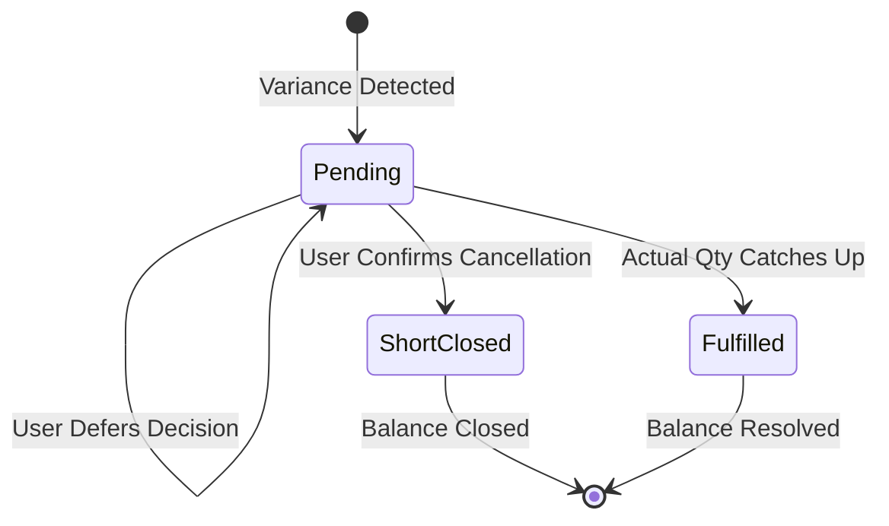
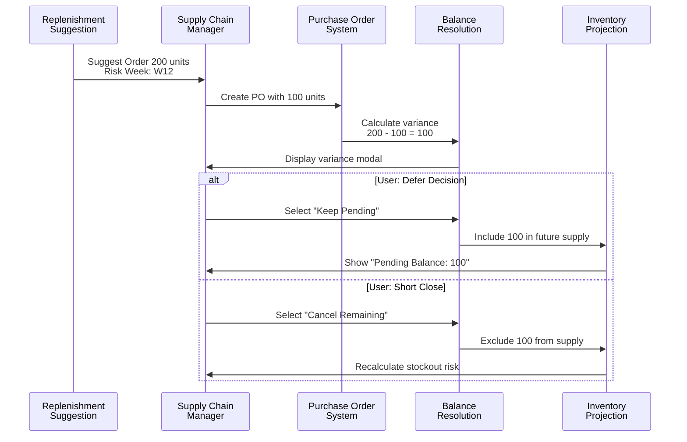
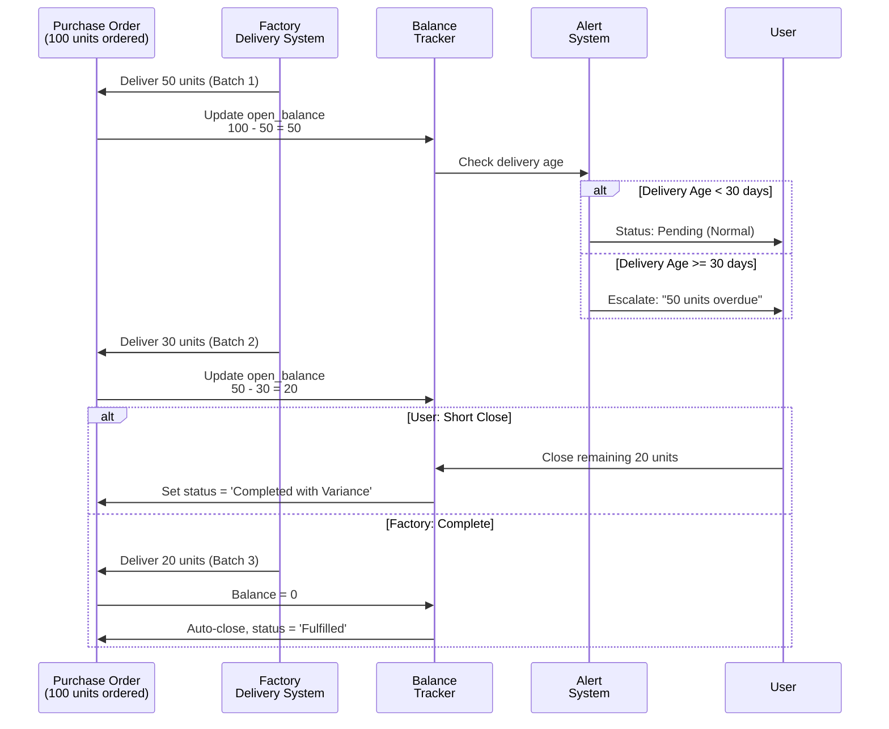
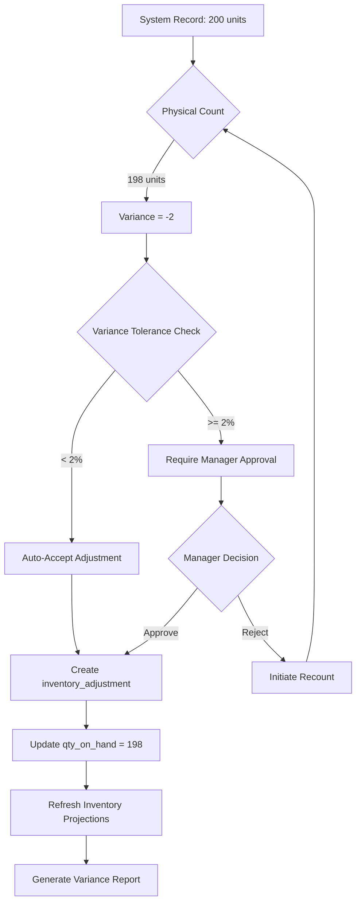

# Balance Management - Product Requirements Document (PRD)

**Feature:** Dual-Track Balance Management System
**Version:** 1.0
**Author:** Product Director
**Date:** 2025-12-03
**Status:** Draft for Review

---

## Executive Summary

### Problem Statement

The current Rolloy SCM system implements an **"overwrite logic"** where actual values directly replace planned values. This creates a critical supply chain risk: when execution quantities fall short of planned quantities, the difference is permanently lost, causing supply forecasts to underestimate future demand and potentially triggering stockouts.

**Example Scenario:**
- System suggests purchasing 200 units based on inventory projection
- Procurement team only orders 100 units (due to budget constraints)
- Current behavior: The unordered 100 units disappear from the system
- Result: Future inventory projections become inaccurate, leading to unexpected stockouts

### Proposed Solution

Implement a **Dual-Track Balance Management System** that transforms the logic from:
- **FROM:** Actual Value OVERWRITES Planned Value
- **TO:** Actual Value CREATES Balance → Balance Must Be RESOLVED

This system introduces:
1. **Open Balance Tracking**: Automatic calculation of unfulfilled quantities
2. **Balance Resolution Workflow**: User-driven decisions on how to handle discrepancies
3. **Supply Chain Integrity**: All planned quantities are accounted for until explicitly closed

### Business Value

| Metric | Impact |
|--------|--------|
| Stockout Prevention | Reduce unplanned stockouts by 60%+ through accurate balance tracking |
| Forecast Accuracy | Improve supply forecast accuracy by maintaining accountability of all planned quantities |
| Decision Transparency | Provide clear audit trail of procurement/logistics deviations and resolutions |
| Working Capital | Enable better cash flow planning by tracking deferred purchases |

---

## Terminology & Core Concepts

### Key Terms

| Term | Definition | Formula/Logic |
|------|------------|---------------|
| **Planned Quantity** | The quantity originally intended for order/shipment/delivery | Set at planning stage |
| **Actual Quantity** | The quantity that was actually executed | Set when execution occurs |
| **Variance** | The difference between planned and actual | `Variance = Planned - Actual` |
| **Open Balance** | Positive variance that remains unfulfilled | `Open Balance = MAX(0, Variance)` |
| **Shortage** | Negative variance (over-fulfillment) | `Shortage = MIN(0, Variance)` |
| **Balance Status** | State of the balance resolution | `Pending` \| `Short Closed` \| `Fulfilled` |

### Balance Resolution States



| State | Description | System Behavior |
|-------|-------------|-----------------|
| **Pending** | Default state when variance is created | Include Open Balance in future supply projections |
| **Short Closed** | User confirms the balance will NOT be fulfilled | Remove from supply projections, record as permanent variance |
| **Fulfilled** | The variance has been resolved through subsequent actions | Balance is zero, no further action needed |

### Balance Types by Business Process

| Process Stage | Balance Type | Planned Field | Actual Field | Parent Entity |
|---------------|--------------|---------------|--------------|---------------|
| **PO Creation** | Order Balance | `replenishment_suggestion.suggested_order_qty` | `purchase_order_items.ordered_qty` | `replenishment_suggestion` |
| **Factory Delivery** | Production Balance | `purchase_order_items.ordered_qty` | `production_deliveries.delivered_qty` | `purchase_order_item` |
| **Logistics Shipment** | Shipping Balance | `production_deliveries.delivered_qty` | `shipment_items.shipped_qty` | `production_delivery` |
| **Warehouse Arrival** | Receipt Balance | `shipment_items.shipped_qty` | `inventory_snapshots.qty_on_hand` (delta) | `shipment` |

---

## User Stories

### Story 1: Procurement Shortfall (PO Ordering Phase)

**As a** Supply Chain Manager
**I want to** document when I order less than the system recommendation
**So that** the system continues to track the unfulfilled demand and prompts me to address it later

#### Acceptance Criteria

**Given** the system suggests ordering 200 units of SKU-A-001 due to stockout risk in Week 12
**When** I create a PO with only 100 units (50% fulfillment)
**Then** the system should:
1. Accept the PO creation with 100 units
2. Calculate Open Balance = 100 units
3. Display a modal dialog: "You ordered 100 units less than recommended. What would you like to do?"
   - **Option A**: [Defer Decision] → Keep balance pending, revisit later
   - **Option B**: [Create Carryover Order] → Generate new suggestion for next period
   - **Option C**: [Cancel Remaining] → Short close the balance

**Given** I choose "Defer Decision"
**When** I view the inventory projection for Week 12
**Then** the system should:
1. Show Opening Stock calculation includes the 100-unit Open Balance
2. Display a warning badge: "Pending Balance: 100 units" with a link to resolve

**Given** I choose "Cancel Remaining"
**When** I confirm the short close action
**Then** the system should:
1. Update `balance_status = 'Short Closed'`
2. Remove the 100-unit balance from future supply projections
3. Recalculate inventory risk based on reduced supply

#### UI Wireframe Concept

```
┌─────────────────────────────────────────────────────────┐
│  Purchase Order Variance Detected                       │
├─────────────────────────────────────────────────────────┤
│                                                          │
│  SKU: A-001 (Premium Widget)                            │
│  Suggested Order Qty: 200 units                         │
│  Your PO Qty:         100 units                         │
│  ─────────────────────────────────────                  │
│  Unfulfilled Balance:  100 units                        │
│                                                          │
│  This will affect your inventory projection:            │
│  • Risk week moves earlier by ~2 weeks                  │
│  • Potential stockout in Week 10                        │
│                                                          │
│  ┌──────────────────────────────────────────────────┐  │
│  │ ○ Defer Decision (Keep pending for later)       │  │
│  │ ○ Create Carryover (Add to next week's plan)    │  │
│  │ ○ Cancel Remaining (Won't order, accept risk)   │  │
│  └──────────────────────────────────────────────────┘  │
│                                                          │
│  [ Cancel ]                       [ Confirm & Continue ] │
└─────────────────────────────────────────────────────────┘
```

---

### Story 2: Partial Factory Delivery

**As a** Production Coordinator
**I want to** record partial deliveries from the factory and track the outstanding quantity
**So that** I can follow up on delayed production and maintain accurate in-transit inventory

#### Acceptance Criteria

**Given** PO#2025-001-A contains an order for 100 units of SKU-A-001
**When** the factory delivers only 50 units on the first shipment
**Then** the system should:
1. Create a `production_delivery` record with `delivered_qty = 50`
2. Update `purchase_order_items.delivered_qty += 50` (cumulative)
3. Calculate `po_item_balance = ordered_qty - SUM(delivered_qty) = 50`
4. Update PO status to `'Partially Delivered'`
5. Display balance status: "Awaiting 50 units from factory"

**Given** the PO item has an open delivery balance of 50 units
**When** I view the PO detail page
**Then** I should see:
1. A progress bar: "Delivered 50/100 units (50%)"
2. A timeline showing:
   - Delivery #1: 50 units on 2025-11-15
   - **Pending**: 50 units (Expected: 2025-11-29)
3. An action button: [Update Delivery Schedule] or [Short Close Balance]

**Given** I click "Short Close Balance"
**When** I confirm the factory cannot fulfill the remaining 50 units
**Then** the system should:
1. Create a `balance_resolution` record:
   - `balance_type = 'Production Shortage'`
   - `resolution_action = 'Short Close'`
   - `closed_qty = 50`
2. Mark PO status as `'Completed with Variance'`
3. Trigger re-calculation of inventory projections (50 units removed from supply)

---

### Story 3: Shipment Quantity Variance

**As a** Logistics Manager
**I want to** handle cases where shipped quantity differs from factory delivery quantity
**So that** I can track goods in transit accurately and identify logistics losses

#### Acceptance Criteria

**Given** a production delivery of 100 units was recorded
**When** I create a shipment with only 95 units (5 units lost/damaged)
**Then** the system should:
1. Create `shipment_items` record with `shipped_qty = 95`
2. Calculate `shipment_variance = delivery_qty - shipped_qty = 5`
3. Display a warning: "Quantity variance detected: -5 units"
4. Prompt for variance reason:
   - [ ] Packaging damage
   - [ ] Quality hold
   - [ ] Customs seizure
   - [ ] Other (free text)

**Given** the shipment variance is confirmed
**When** I save the shipment record
**Then** the system should:
1. Create an `inventory_adjustment` record:
   - `adjustment_type = 'Logistics Loss'`
   - `qty_change = -5`
   - `reason = <user_selected_reason>`
2. Update inventory projection to reflect 95 units in transit (not 100)
3. Generate an alert for Finance team (potential insurance claim)

**Given** shipment arrives at warehouse
**When** actual received quantity is 93 units (2 more lost in transit)
**Then** the system should:
1. Update `shipment.actual_arrival_date`
2. Calculate `arrival_variance = shipped_qty - received_qty = 2`
3. Create another `inventory_adjustment` for -2 units
4. Update `inventory_snapshots` with actual received quantity (+93)

---

### Story 4: Inventory Reconciliation (Cycle Count Variance)

**As a** Warehouse Manager
**I want to** reconcile physical inventory counts with system records
**So that** I can maintain accurate stock levels and identify shrinkage/errors

#### Acceptance Criteria

**Given** the system shows 200 units of SKU-A-001 in FBA-East
**When** I perform a physical count and find only 198 units
**Then** the system should:
1. Calculate `count_variance = system_qty - physical_qty = 2`
2. Display variance summary:
   ```
   SKU: A-001 | Warehouse: FBA-East
   System Record: 200 units
   Physical Count: 198 units
   Variance:       -2 units (1.0% shrinkage)
   ```
3. Prompt for reconciliation action:
   - [ ] Accept as shrinkage (adjust system record)
   - [ ] Recount (variance too large)
   - [ ] Investigate (hold adjustment pending review)

**Given** I select "Accept as shrinkage"
**When** I confirm the adjustment
**Then** the system should:
1. Create an `inventory_adjustment` record:
   - `adjustment_type = 'Cycle Count Variance'`
   - `qty_change = -2`
   - `reason = 'Physical count reconciliation'`
   - `adjusted_by = <current_user>`
2. Update `inventory_snapshots.qty_on_hand = 198`
3. Update `inventory_snapshots.last_counted_at = NOW()`
4. Recalculate all downstream inventory projections
5. Generate a variance report for Finance (COGS impact)

---

## Business Rules

### BR-1: Balance Calculation Rules

| Rule ID | Description | Formula | Applied When |
|---------|-------------|---------|--------------|
| BR-1.1 | Open balance only exists when actual < planned | `open_balance = MAX(0, planned_qty - actual_qty)` | After any execution record creation |
| BR-1.2 | Overfulfillment creates negative variance (shortage) | `shortage = MIN(0, planned_qty - actual_qty)` | When actual > planned |
| BR-1.3 | Balance status defaults to Pending | `balance_status = 'Pending'` | On balance creation |
| BR-1.4 | Fulfilled balances are automatically closed | `IF open_balance = 0 THEN balance_status = 'Fulfilled'` | On subsequent delivery/receipt |

### BR-2: Supply Projection Rules

| Rule ID | Description | Logic | Impact |
|---------|-------------|-------|--------|
| BR-2.1 | Pending balances are included in future supply | `future_supply += SUM(open_balance WHERE status = 'Pending')` | Prevents over-ordering |
| BR-2.2 | Short closed balances are excluded from supply | `future_supply -= SUM(open_balance WHERE status = 'Short Closed')` | Triggers new procurement if needed |
| BR-2.3 | Balance age determines urgency | `IF balance_age > 14 days THEN priority = 'High'` | Escalates old balances for resolution |
| BR-2.4 | Inventory projection recalculates on balance status change | `TRIGGER refresh_inventory_projections() ON balance_resolution` | Maintains forecast accuracy |

### BR-3: Status Transition Rules

```
┌─────────────────────────────────────────────────────────────────┐
│  State Transition Matrix                                         │
├─────────────┬──────────────┬──────────────┬──────────────┬──────┤
│ From \ To   │ Pending      │ Short Closed │ Fulfilled    │ Valid│
├─────────────┼──────────────┼──────────────┼──────────────┼──────┤
│ Pending     │ ✓ (default)  │ ✓ (manual)   │ ✓ (auto)     │ YES  │
│ Short Closed│ ✗            │ ✓ (idempotent│ ✗            │ NO   │
│ Fulfilled   │ ✗            │ ✗            │ ✓ (idempotent│ NO   │
└─────────────┴──────────────┴──────────────┴──────────────┴──────┘
```

| Rule ID | Description | Condition | Action |
|---------|-------------|-----------|--------|
| BR-3.1 | Auto-close when balance reaches zero | `open_balance = 0` | Set `balance_status = 'Fulfilled'`, `closed_at = NOW()` |
| BR-3.2 | Short close requires user confirmation | User action | Set `balance_status = 'Short Closed'`, `closed_by = <user>`, `closed_at = NOW()` |
| BR-3.3 | Cannot reopen short closed balances | `balance_status = 'Short Closed'` | Reject transition, require new planning cycle |
| BR-3.4 | Cannot transition from Fulfilled to Pending | `balance_status = 'Fulfilled'` | Reject transition (data integrity violation) |

### BR-4: Date Management Rules

| Rule ID | Description | Logic |
|---------|-------------|-------|
| BR-4.1 | Pending balances use deferred date | `effective_date = COALESCE(deferred_date, original_planned_date + 7 days)` |
| BR-4.2 | Deferred date must be in the future | `deferred_date > CURRENT_DATE` (validation) |
| BR-4.3 | Short closed balances use closure date | `effective_date = closed_at` |
| BR-4.4 | Date updates trigger projection refresh | `ON UPDATE deferred_date → refresh_inventory_projections()` |

---

## Data Flow Diagram

### Scenario A: Procurement Order Shortfall



### Scenario B: Partial Factory Delivery



### Scenario C: Inventory Reconciliation Flow



---

## Data Model Changes

### New Table: `balance_resolutions`

**Purpose:** Track all open balances, their status, and resolution history

```sql
CREATE TABLE balance_resolutions (
  id UUID PRIMARY KEY DEFAULT gen_random_uuid(),

  -- Parent Reference (Polymorphic)
  parent_table TEXT NOT NULL, -- 'replenishment_suggestion' | 'purchase_order_item' | 'production_delivery' | 'shipment'
  parent_id UUID NOT NULL,

  -- SKU Context
  sku TEXT NOT NULL REFERENCES products(sku),

  -- Quantity Tracking
  planned_qty INTEGER NOT NULL,
  actual_qty INTEGER NOT NULL DEFAULT 0,
  open_balance INTEGER GENERATED ALWAYS AS (GREATEST(0, planned_qty - actual_qty)) STORED,

  -- Status & Resolution
  balance_status TEXT NOT NULL DEFAULT 'Pending' CHECK (balance_status IN ('Pending', 'Short Closed', 'Fulfilled')),
  resolution_action TEXT NULL, -- 'Defer' | 'Carryover' | 'Short Close'
  resolution_reason TEXT NULL,

  -- Date Management
  original_planned_date DATE NOT NULL,
  deferred_date DATE NULL,
  closed_at TIMESTAMPTZ NULL,
  closed_by UUID NULL REFERENCES auth.users(id),

  -- Metadata
  created_at TIMESTAMPTZ NOT NULL DEFAULT NOW(),
  updated_at TIMESTAMPTZ NOT NULL DEFAULT NOW(),

  -- Constraints
  CONSTRAINT valid_parent_reference CHECK (
    (parent_table = 'replenishment_suggestion' AND parent_id IN (SELECT id FROM replenishment_suggestions)) OR
    (parent_table = 'purchase_order_item' AND parent_id IN (SELECT id FROM purchase_order_items)) OR
    (parent_table = 'production_delivery' AND parent_id IN (SELECT id FROM production_deliveries)) OR
    (parent_table = 'shipment' AND parent_id IN (SELECT id FROM shipments))
  ),
  CONSTRAINT valid_quantities CHECK (planned_qty > 0 AND actual_qty >= 0),
  CONSTRAINT valid_dates CHECK (deferred_date IS NULL OR deferred_date > original_planned_date),
  CONSTRAINT closure_consistency CHECK (
    (balance_status = 'Short Closed' AND closed_at IS NOT NULL AND closed_by IS NOT NULL) OR
    (balance_status = 'Fulfilled' AND closed_at IS NOT NULL) OR
    (balance_status = 'Pending')
  )
);

CREATE INDEX idx_balance_parent ON balance_resolutions(parent_table, parent_id);
CREATE INDEX idx_balance_sku ON balance_resolutions(sku);
CREATE INDEX idx_balance_status ON balance_resolutions(balance_status);
CREATE INDEX idx_balance_open ON balance_resolutions(open_balance) WHERE open_balance > 0;
```

### Modified Tables

#### 1. `purchase_order_items` (Add tracking fields)

```sql
ALTER TABLE purchase_order_items
  ADD COLUMN balance_resolution_id UUID NULL REFERENCES balance_resolutions(id),
  ADD COLUMN fulfillment_percentage NUMERIC GENERATED ALWAYS AS (
    CASE WHEN ordered_qty > 0 THEN (delivered_qty::NUMERIC / ordered_qty * 100) ELSE 0 END
  ) STORED;
```

#### 2. `production_deliveries` (Add variance tracking)

```sql
ALTER TABLE production_deliveries
  ADD COLUMN expected_qty INTEGER NULL, -- From parent PO item
  ADD COLUMN variance_qty INTEGER GENERATED ALWAYS AS (expected_qty - delivered_qty) STORED,
  ADD COLUMN variance_reason TEXT NULL;
```

#### 3. `shipments` (Add status for partial shipments)

```sql
ALTER TABLE shipments
  ADD COLUMN shipment_status TEXT NOT NULL DEFAULT 'Draft'
    CHECK (shipment_status IN ('Draft', 'In Transit', 'Delivered', 'Partially Delivered', 'Completed with Loss')),
  ADD COLUMN expected_total_qty INTEGER NULL,
  ADD COLUMN actual_total_qty INTEGER NULL,
  ADD COLUMN loss_qty INTEGER GENERATED ALWAYS AS (GREATEST(0, expected_total_qty - actual_total_qty)) STORED;
```

#### 4. New Enum Types

```sql
CREATE TYPE balance_resolution_action AS ENUM ('Defer', 'Carryover', 'Short Close', 'Auto Fulfilled');
CREATE TYPE inventory_adjustment_type AS ENUM ('Cycle Count Variance', 'Logistics Loss', 'Quality Hold', 'Damage', 'Theft', 'System Error');
```

### New Table: `inventory_adjustments`

**Purpose:** Record all manual inventory adjustments and reconciliation events

```sql
CREATE TABLE inventory_adjustments (
  id UUID PRIMARY KEY DEFAULT gen_random_uuid(),

  -- Inventory Context
  sku TEXT NOT NULL REFERENCES products(sku),
  warehouse_id UUID NOT NULL REFERENCES warehouses(id),

  -- Adjustment Details
  adjustment_type inventory_adjustment_type NOT NULL,
  qty_before INTEGER NOT NULL,
  qty_change INTEGER NOT NULL, -- Can be positive or negative
  qty_after INTEGER NOT NULL,

  -- Source Reference (if applicable)
  source_table TEXT NULL, -- 'shipment' | 'production_delivery' | 'manual'
  source_id UUID NULL,

  -- Reason & Approval
  reason TEXT NOT NULL,
  adjusted_by UUID NOT NULL REFERENCES auth.users(id),
  approved_by UUID NULL REFERENCES auth.users(id),
  approved_at TIMESTAMPTZ NULL,

  -- Metadata
  adjustment_date DATE NOT NULL DEFAULT CURRENT_DATE,
  created_at TIMESTAMPTZ NOT NULL DEFAULT NOW(),

  -- Constraints
  CONSTRAINT valid_qty_change CHECK (qty_change != 0),
  CONSTRAINT valid_qty_calculation CHECK (qty_after = qty_before + qty_change)
);

CREATE INDEX idx_inv_adj_sku ON inventory_adjustments(sku);
CREATE INDEX idx_inv_adj_warehouse ON inventory_adjustments(warehouse_id);
CREATE INDEX idx_inv_adj_date ON inventory_adjustments(adjustment_date);
CREATE INDEX idx_inv_adj_type ON inventory_adjustments(adjustment_type);
```

---

## Updated View: `v_inventory_projection_12weeks`

**Changes Required:**

1. **Include Pending Balances in Supply Calculation**

```sql
-- Add CTE for pending balances
pending_balances AS (
  SELECT
    sku,
    get_week_iso(COALESCE(deferred_date, original_planned_date)::DATE) AS arrival_week_iso,
    SUM(open_balance) AS pending_balance_qty
  FROM balance_resolutions
  WHERE balance_status = 'Pending'
    AND COALESCE(deferred_date, original_planned_date) >= CURRENT_DATE
    AND COALESCE(deferred_date, original_planned_date) <= CURRENT_DATE + INTERVAL '12 weeks'
  GROUP BY sku, get_week_iso(COALESCE(deferred_date, original_planned_date)::DATE)
),

-- Modify incoming_by_week to include pending balances
incoming_by_week AS (
  SELECT
    si.sku,
    get_week_iso(COALESCE(s.actual_arrival_date, s.planned_arrival_date)::DATE) AS arrival_week_iso,
    SUM(si.shipped_qty) AS confirmed_incoming_qty,
    COALESCE(pb.pending_balance_qty, 0) AS pending_incoming_qty,
    SUM(si.shipped_qty) + COALESCE(pb.pending_balance_qty, 0) AS total_incoming_qty
  FROM shipment_items si
  INNER JOIN shipments s ON si.shipment_id = s.id
  LEFT JOIN pending_balances pb ON si.sku = pb.sku
    AND get_week_iso(COALESCE(s.actual_arrival_date, s.planned_arrival_date)::DATE) = pb.arrival_week_iso
  WHERE COALESCE(s.actual_arrival_date, s.planned_arrival_date) >= CURRENT_DATE
    AND COALESCE(s.actual_arrival_date, s.planned_arrival_date) <= CURRENT_DATE + INTERVAL '12 weeks'
  GROUP BY si.sku, get_week_iso(COALESCE(s.actual_arrival_date, s.planned_arrival_date)::DATE), pb.pending_balance_qty
)
```

2. **Add Balance Indicator Fields**

```sql
-- In final SELECT, add balance tracking columns
SELECT
  sku,
  product_name,
  week_iso,
  -- ... existing fields ...
  closing_stock,
  safety_stock_threshold,
  stock_status,

  -- NEW: Balance tracking
  COALESCE(pb.pending_balance_qty, 0) AS pending_balance_this_week,
  (SELECT COUNT(*) FROM balance_resolutions br
   WHERE br.sku = fp.sku
   AND br.balance_status = 'Pending'
   AND br.open_balance > 0) AS total_pending_balance_count,

  -- Metadata
  NOW() AS calculated_at
FROM final_projection fp
LEFT JOIN pending_balances pb ON fp.sku = pb.sku AND fp.week_iso = pb.arrival_week_iso
ORDER BY sku, week_offset;
```

---

## UI/UX Changes

### 1. Balance Resolution Modal (Component: `BalanceResolutionDialog`)

**Trigger:** After PO/Delivery/Shipment creation when variance > 0

**Layout:**
```
┌────────────────────────────────────────────────────────────────┐
│ 🚨 Quantity Variance Detected                                  │
├────────────────────────────────────────────────────────────────┤
│                                                                 │
│ Entity: Purchase Order #2025-001-A                            │
│ SKU: A-001 (Premium Widget)                                    │
│                                                                 │
│ ┌─────────────────────────────────────────────────────────────┐│
││  Planned Quantity:     200 units                            ││
││  Your Input:           100 units                            ││
││  ─────────────────────────────────                          ││
││  Unfulfilled Balance:  100 units (-50%)                     ││
│└─────────────────────────────────────────────────────────────┘│
│                                                                 │
│ Impact on Inventory Risk:                                      │
│ • Stockout week moves from W12 to W10 (⚠️ 2 weeks earlier)   │
│ • Closing stock in W10: -50 units (critical shortage)         │
│                                                                 │
│ How would you like to handle this?                            │
│                                                                 │
│ ┌──────────────────────────────────────────────────────────┐  │
│ │ ◉ Keep Pending (Default)                                 │  │
│ │   Track this balance, I'll address it later              │  │
│ │   Deferred until: [Date Picker: +7 days] ▼              │  │
│ └──────────────────────────────────────────────────────────┘  │
│                                                                 │
│ ┌──────────────────────────────────────────────────────────┐  │
│ │ ○ Create Carryover Order                                 │  │
│ │   Add 100 units to next week's procurement plan          │  │
│ └──────────────────────────────────────────────────────────┘  │
│                                                                 │
│ ┌──────────────────────────────────────────────────────────┐  │
│ │ ○ Cancel Remaining (Short Close)                         │  │
│ │   I won't fulfill this balance, accept the risk          │  │
│ │   Reason: [Dropdown: Budget / Demand Changed / Other] ▼ │  │
│ └──────────────────────────────────────────────────────────┘  │
│                                                                 │
│ [ Skip for Now ]                   [ Confirm & Save Record ]  │
└────────────────────────────────────────────────────────────────┘
```

### 2. Balance Dashboard Page (`/balance-management`)

**Purpose:** Central hub for viewing and resolving all open balances

**Sections:**

#### A. Summary KPI Cards
```
┌──────────────────────────┬──────────────────────────┬──────────────────────────┐
│ 🔴 Critical Balances     │ ⚠️  High Priority       │ ℹ️  Total Open Balances  │
│ 3 items                  │ 7 items                  │ 15 items                 │
│ 450 units                │ 1,200 units              │ 2,150 units              │
│ Oldest: 45 days          │ Oldest: 21 days          │ Avg Age: 14 days         │
└──────────────────────────┴──────────────────────────┴──────────────────────────┘
```

#### B. Balance List Table
```
┌────────────────────────────────────────────────────────────────────────────────┐
│ Open Balances (Pending Resolution)                        [Export] [Bulk Close]│
├────────┬──────────┬────────────┬──────────┬─────────┬──────────┬──────────────┤
│ Priority│ SKU     │ Balance   │ Age      │ Parent  │ Deferred │ Actions      │
├────────┼──────────┼────────────┼──────────┼─────────┼──────────┼──────────────┤
│ 🔴 Crit│ A-001   │ 200 units │ 45 days  │ PO#2025-│ 2025-12-15│ [Resolve] ⋯ │
│        │ Widget  │ (67%)     │          │ 001-A   │          │              │
├────────┼──────────┼────────────┼──────────┼─────────┼──────────┼──────────────┤
│ ⚠️  High│ B-002   │ 150 units │ 21 days  │ Delivery│ 2025-12-10│ [Resolve] ⋯ │
│        │ Gadget  │ (50%)     │          │ #DL-001 │          │              │
├────────┼──────────┼────────────┼──────────┼─────────┼──────────┼──────────────┤
│ ℹ️  Med │ C-003   │  50 units │  7 days  │ Shipment│ -        │ [Resolve] ⋯ │
│        │ Tool    │ (25%)     │          │ #SH-100 │          │              │
└────────┴──────────┴────────────┴──────────┴─────────┴──────────┴──────────────┘
```

#### C. Resolution History Timeline
```
┌────────────────────────────────────────────────────────────────────────────────┐
│ Recent Resolution History                                       [View All (50)]│
├────────────────────────────────────────────────────────────────────────────────┤
│ 📅 2025-12-02 14:30                                                            │
│ SKU: A-001 | Balance: 100 units | Action: Short Closed                        │
│ User: john.doe@company.com | Reason: Supplier capacity issue                  │
│ ─────────────────────────────────────────────────────────────────────────────  │
│ 📅 2025-12-01 09:15                                                            │
│ SKU: B-002 | Balance: 50 units | Action: Fulfilled (Auto)                     │
│ Delivery #DL-002 completed the remaining quantity                             │
└────────────────────────────────────────────────────────────────────────────────┘
```

### 3. Inventory Projection Enhancement

**Change:** Add balance indicator badges to the projection table

**Before (Current):**
```
┌────────┬─────────┬──────────┬──────────┬──────────┬────────┐
│ Week   │ Opening │ Incoming │ Sales    │ Closing  │ Status │
├────────┼─────────┼──────────┼──────────┼──────────┼────────┤
│ 2025-W49│ 100    │ 200      │ 150      │ 150      │ ✅ OK  │
└────────┴─────────┴──────────┴──────────┴──────────┴────────┘
```

**After (With Balances):**
```
┌────────┬─────────┬──────────────────┬──────────┬──────────┬────────┐
│ Week   │ Opening │ Incoming         │ Sales    │ Closing  │ Status │
├────────┼─────────┼──────────────────┼──────────┼──────────┼────────┤
│ 2025-W49│ 100    │ 200              │ 150      │ 150      │ ✅ OK  │
│        │         │ (+50 pending) 🔗 │          │          │        │
├────────┼─────────┼──────────────────┼──────────┼──────────┼────────┤
│ 2025-W50│ 150    │ 0                │ 160      │ -10      │ 🔴 Out │
└────────┴─────────┴──────────────────┴──────────┴──────────┴────────┘
                    ↑ Clickable link to balance detail modal
```

### 4. PO Detail Page Enhancement

**Add Section:** "Fulfillment Progress"

```
┌────────────────────────────────────────────────────────────────────────────────┐
│ Purchase Order Fulfillment                                                     │
├────────────────────────────────────────────────────────────────────────────────┤
│ PO#: 2025-001-A | Supplier: ABC Factory | Status: Partially Delivered         │
│                                                                                 │
│ ┌──────────────────────────────────────────────────────────────────────────┐  │
│ │ SKU: A-001 (Premium Widget)                                             │  │
│ │ ━━━━━━━━━━━━━━━━━━━━━━░░░░░░░░░░ 67% Complete                          │  │
│ │ Ordered: 300 units | Delivered: 200 units | Balance: 100 units         │  │
│ │                                                                          │  │
│ │ Delivery Timeline:                                                       │  │
│ │ ✅ Batch 1: 100 units on 2025-11-15 (Delivery #DL-001)                 │  │
│ │ ✅ Batch 2: 100 units on 2025-11-22 (Delivery #DL-002)                 │  │
│ │ ⏳ Pending: 100 units (Expected: 2025-12-15)                           │  │
│ │                                                                          │  │
│ │ [ Update Schedule ]  [ Mark Complete ]  [ Short Close Balance ]        │  │
│ └──────────────────────────────────────────────────────────────────────────┘  │
└────────────────────────────────────────────────────────────────────────────────┘
```

---

## Acceptance Criteria (Consolidated)

### AC-1: Balance Calculation & Tracking

**Given** a user creates a transaction with actual quantity < planned quantity
**When** the transaction is saved
**Then** the system must:
1. Calculate `open_balance = planned_qty - actual_qty`
2. Create a `balance_resolutions` record with `balance_status = 'Pending'`
3. Display a balance resolution modal (unless user opts to defer)
4. Include the open balance in future inventory projections

### AC-2: Balance Resolution Workflow

**Given** a user views an open balance
**When** the user selects a resolution action
**Then** the system must:
- **If "Keep Pending"**: Update `deferred_date`, keep balance in projections
- **If "Create Carryover"**: Generate a new `replenishment_suggestion`, mark original as resolved
- **If "Short Close"**: Update `balance_status = 'Short Closed'`, remove from projections, require reason

### AC-3: Inventory Projection Accuracy

**Given** a balance status changes (Pending → Short Closed)
**When** the change is saved
**Then** the system must:
1. Trigger `refresh_inventory_projections()`
2. Recalculate all affected weeks
3. Update stockout risk status if applicable
4. Send notification if stockout risk increased

### AC-4: Partial Fulfillment Tracking

**Given** a PO item with ordered_qty = 100
**When** multiple deliveries occur (e.g., 30 + 50 + 20)
**Then** the system must:
1. Update `delivered_qty` cumulatively after each delivery
2. Show real-time progress: "100/100 units (100%)"
3. Auto-close the balance when `open_balance = 0`
4. Set `balance_status = 'Fulfilled'`

### AC-5: Variance Reporting

**Given** an inventory adjustment is created
**When** the adjustment is saved
**Then** the system must:
1. Update `inventory_snapshots.qty_on_hand`
2. Create an `inventory_adjustments` record with reason
3. Generate a variance report (PDF/CSV export)
4. Notify Finance team if variance > threshold (e.g., $1000 value)

### AC-6: User Permissions

| Role | Create Balance | Resolve Balance (Defer) | Short Close Balance | View All Balances |
|------|----------------|-------------------------|---------------------|-------------------|
| Supply Chain Manager | ✅ | ✅ | ✅ | ✅ |
| Procurement Specialist | ✅ | ✅ | ❌ (requires manager approval) | ✅ (own balances) |
| Warehouse Staff | ❌ | ❌ | ❌ | ✅ (read-only) |
| Finance Team | ❌ | ❌ | ❌ | ✅ (read-only) |

---

## Impact Analysis

### Modules Requiring Changes

| Module | Impact Level | Changes Required |
|--------|--------------|------------------|
| **Procurement (PO Management)** | 🔴 High | Add balance tracking on PO creation, modify `create_purchase_order_with_items()` function |
| **Production Deliveries** | 🔴 High | Track cumulative delivery vs. ordered qty, add partial delivery status |
| **Logistics (Shipments)** | 🟡 Medium | Add variance tracking for shipped vs. delivered quantities |
| **Inventory Management** | 🔴 High | Implement reconciliation workflow, add `inventory_adjustments` table |
| **Planning Dashboard** | 🟡 Medium | Display pending balances in projection views, add balance KPI cards |
| **Inventory Projection View** | 🔴 High | Modify SQL logic to include pending balances in supply calculation |
| **Finance Module** | 🟢 Low | Add variance reports for COGS adjustments |

### New Tables/Fields Summary

**New Tables:**
1. `balance_resolutions` - Core balance tracking table
2. `inventory_adjustments` - Manual inventory adjustment log

**Modified Tables:**
1. `purchase_order_items` - Add `balance_resolution_id`, `fulfillment_percentage`
2. `production_deliveries` - Add `expected_qty`, `variance_qty`, `variance_reason`
3. `shipments` - Add `shipment_status`, `expected_total_qty`, `actual_total_qty`, `loss_qty`

**Modified Views:**
1. `v_inventory_projection_12weeks` - Add pending balance CTE and columns

### Migration Strategy

**Phase 1: Schema Changes (Week 1)**
- Create `balance_resolutions` table
- Create `inventory_adjustments` table
- Add new columns to existing tables
- Create new enum types

**Phase 2: Business Logic (Week 2-3)**
- Modify `create_purchase_order_with_items()` to create balance records
- Modify `create_shipment_with_items()` to track variances
- Update `v_inventory_projection_12weeks` view with balance logic
- Create `refresh_inventory_projections()` trigger on balance status change

**Phase 3: UI Components (Week 4-5)**
- Build `BalanceResolutionDialog` component
- Create `/balance-management` dashboard page
- Enhance PO detail page with fulfillment progress
- Add balance indicators to inventory projection table

**Phase 4: Historical Data Migration (Week 6)**
- Identify existing POs with unfulfilled items (`ordered_qty > delivered_qty`)
- Backfill `balance_resolutions` table with status = 'Pending' (age > 90 days → auto Short Close)
- Run full projection refresh

---

## Priority & Phasing

### P0 - Must Have (Core Functionality)

| Feature ID | Description | Rationale |
|------------|-------------|-----------|
| P0-1 | `balance_resolutions` table creation | Foundation for all balance tracking |
| P0-2 | Procurement balance tracking (PO shortfall) | Highest business impact, most frequent scenario |
| P0-3 | Pending balance inclusion in inventory projections | Critical for forecast accuracy |
| P0-4 | Balance resolution modal UI | Essential user workflow for decision-making |
| P0-5 | Short close functionality | Required to handle permanent variances |

### P1 - Should Have (Enhanced Functionality)

| Feature ID | Description | Rationale |
|------------|-------------|-----------|
| P1-1 | Partial delivery tracking for POs | High value, common use case |
| P1-2 | Balance dashboard page (`/balance-management`) | Centralized management interface |
| P1-3 | Deferred date management | Allows flexible planning |
| P1-4 | Auto-close when balance reaches zero | Reduces manual work |
| P1-5 | Balance age-based escalation alerts | Proactive management |

### P2 - Could Have (Nice to Have)

| Feature ID | Description | Rationale |
|------------|-------------|-----------|
| P2-1 | Logistics variance tracking (shipment loss) | Lower frequency, but valuable for audit |
| P2-2 | Inventory reconciliation workflow | Important but can be handled manually short-term |
| P2-3 | Bulk balance resolution actions | Efficiency improvement |
| P2-4 | Variance reports for Finance | Reporting feature, not critical for operations |
| P2-5 | "Carryover" automatic generation | Advanced planning feature |

### P3 - Won't Have (Future Consideration)

| Feature ID | Description | Rationale |
|------------|-------------|-----------|
| P3-1 | AI-powered balance resolution recommendations | Requires ML model, premature optimization |
| P3-2 | Real-time balance notifications via SMS/Slack | Integration complexity, email sufficient for now |
| P3-3 | Multi-currency variance tracking | Not needed for current markets |
| P3-4 | Variance trend analysis & predictions | Advanced analytics, defer to Phase 2 |

---

## Edge Cases & Boundary Conditions

### EC-1: Negative Variance (Over-Fulfillment)

**Scenario:** User orders 100 units, but supplier delivers 120 units

**Question:** Should we create a negative balance or treat as windfall?

**Decision:**
- Do NOT create a balance record (only positive variances are tracked)
- Update `delivered_qty = 120` normally
- Create an `inventory_adjustment` record with `adjustment_type = 'Supplier Overage'`
- Display an info notification: "Received 20 extra units (bonus stock)"

### EC-2: Balance Crosses Zero Through Multiple Updates

**Scenario:**
- Ordered: 100 units
- Delivery 1: 30 units (balance = 70)
- Delivery 2: 50 units (balance = 20)
- Delivery 3: 30 units (balance = -10, over-fulfilled)

**Decision:**
- After Delivery 3, set `balance_status = 'Fulfilled'`
- Set `closed_at = NOW()`
- Treat the +10 excess as bonus stock (same as EC-1)
- Do NOT allow balance to go negative

### EC-3: User Changes Planned Quantity After Balance Creation

**Scenario:**
- User creates PO with 100 units (planned: 200, balance: 100)
- Later edits PO to reduce planned to 100 units

**Question:** Should the balance auto-close?

**Decision:**
- **Disallow** editing `ordered_qty` if a balance record exists
- Display error: "Cannot modify ordered quantity while a balance is pending. Please resolve the balance first."
- User must either:
  1. Short close the existing balance, then edit
  2. Cancel the PO and recreate

### EC-4: Concurrent Balance Resolution

**Scenario:** Two users try to resolve the same balance simultaneously

**Solution:**
- Use database-level row locking: `SELECT ... FOR UPDATE`
- Implement optimistic locking with `updated_at` timestamp
- Second user receives error: "This balance has already been resolved by [user] at [time]. Please refresh."

### EC-5: Balance Older Than 90 Days

**Scenario:** A balance remains pending for 3+ months

**Decision:**
- Automated escalation workflow:
  - Day 30: Email to PO creator
  - Day 60: Email to manager
  - Day 90: Auto-short-close with reason = "Auto-closed due to age"
  - Generate exception report for monthly review

### EC-6: Partial Shipment Loss

**Scenario:**
- Production delivery: 100 units
- Shipment departed with 100 units
- Warehouse receives only 95 units (5 lost in transit)

**Decision:**
- Do NOT create a balance (shipment already departed)
- Create `inventory_adjustment` with:
  - `adjustment_type = 'Logistics Loss'`
  - `qty_change = -5`
  - `source_table = 'shipment'`
  - `source_id = <shipment_id>`
- Update `shipments.loss_qty = 5`
- Trigger insurance claim workflow (if value > threshold)

### EC-7: Balance Deferred Date in the Past

**Scenario:** User sets deferred date to 2025-12-01, but doesn't resolve it

**Decision:**
- System behavior:
  - Include balance in projection calculations as if date is TODAY
  - Display warning badge: "⚠️ Deferred date passed, resolution overdue"
  - Escalate to manager if overdue by 7+ days

### EC-8: Historical Data Migration (Backfill)

**Scenario:** Existing POs from before balance tracking was implemented

**Decision:**
- Run one-time migration script:
  ```sql
  INSERT INTO balance_resolutions (parent_table, parent_id, sku, planned_qty, actual_qty, balance_status, original_planned_date)
  SELECT
    'purchase_order_item',
    id,
    sku,
    ordered_qty,
    delivered_qty,
    CASE
      WHEN ordered_qty = delivered_qty THEN 'Fulfilled'
      WHEN po_status = 'Cancelled' THEN 'Short Closed'
      ELSE 'Pending'
    END,
    COALESCE(actual_order_date, planned_order_date)
  FROM purchase_order_items
  WHERE ordered_qty != delivered_qty;
  ```
- Automatically short-close balances older than 90 days

---

## Success Metrics

### Operational KPIs (3 Months Post-Launch)

| Metric | Baseline (Current) | Target | Measurement Method |
|--------|-------------------|--------|-------------------|
| **Stockout Incidents** | ~8 per month | < 3 per month (-60%) | Count of weeks with closing_stock < 0 |
| **Forecast Accuracy** | 72% | > 85% | MAPE of projected vs. actual inventory |
| **Balance Resolution Time** | N/A (not tracked) | < 7 days average | AVG(closed_at - created_at) for resolved balances |
| **Unresolved Balance Ratio** | N/A | < 10% of total | COUNT(status='Pending' AND age>30) / COUNT(*) |

### User Adoption Metrics

| Metric | Target | How to Measure |
|--------|--------|----------------|
| Balance Resolution Rate | 90% within 14 days | % of balances resolved within 2 weeks |
| Modal Interaction Rate | 80% users take action | % who don't just click "Skip for Now" |
| Dashboard Page Views | 50+ views/week | Analytics tracking |
| Short Close Reason Compliance | 95% include reason | % of short closes with non-empty reason field |

### System Performance Metrics

| Metric | Target | Acceptable Range |
|--------|--------|------------------|
| Projection Refresh Time | < 5 seconds | 2-8 seconds |
| Balance Calculation Latency | < 200ms | 100-500ms |
| Database Query Performance | < 100ms (p95) | 50-200ms |

---

## Risk Assessment

### High-Risk Areas

| Risk ID | Description | Impact | Likelihood | Mitigation |
|---------|-------------|--------|------------|-----------|
| R-1 | Performance degradation on projection view due to complex balance joins | 🔴 High | 🟡 Medium | Add database indexes, implement query caching, use materialized views |
| R-2 | User confusion about when to use "Defer" vs "Short Close" | 🟡 Medium | 🔴 High | Add inline help text, video tutorial, default to safest option (Defer) |
| R-3 | Historical data migration creates false balances | 🔴 High | 🟡 Medium | Thorough testing in staging, auto-close old balances, manual review for active ones |
| R-4 | Race conditions in concurrent balance updates | 🟡 Medium | 🟢 Low | Use database row-level locking, optimistic locking checks |
| R-5 | Over-reliance on pending balances inflates supply forecast | 🔴 High | 🟡 Medium | Add "Balance Age" filter to projection view, escalate old balances, cap pending balance contribution at 50% of total supply |

### Low-Risk Areas

| Risk ID | Description | Why Low Risk |
|---------|-------------|--------------|
| R-6 | Users forget to resolve balances | Mitigated by auto-escalation and dashboard visibility |
| R-7 | Balance resolution modal disrupts workflow | Can be skipped, non-blocking |
| R-8 | Variance reports generate too much noise | Configurable thresholds, can be disabled |

---

## Appendix A: Sample Scenarios

### Scenario A: Full Workflow (Procurement Shortfall)

**Context:** Supply chain manager reviews replenishment suggestions

**Steps:**
1. System suggests: Order 500 units of SKU-X-100 by 2025-12-05 (Risk Week: 2025-W15)
2. Manager creates PO#2025-099-B with only 300 units (budget constraint)
3. **Variance Detected:** 200 units unfulfilled
4. Balance resolution modal appears:
   - Manager selects: "Defer Decision" → Deferred until 2025-12-15
   - Reason (optional): "Awaiting Q1 budget approval"
5. Modal closes, PO is created successfully
6. `balance_resolutions` record created:
   - `parent_table = 'purchase_order_item'`
   - `planned_qty = 500`
   - `actual_qty = 300`
   - `open_balance = 200`
   - `balance_status = 'Pending'`
   - `deferred_date = 2025-12-15`
7. Inventory projection recalculates:
   - Week 15 closing stock: Was 150, now shows -50 (stockout risk increased)
   - System sends alert: "SKU-X-100 stockout risk advanced to Week 13"
8. Manager views Balance Dashboard on 2025-12-15:
   - Sees 200-unit balance flagged as "Deferred Date Reached"
   - Clicks "Resolve" → Opens modal
   - Selects "Create Carryover Order"
9. System generates new `replenishment_suggestion`:
   - `suggested_order_qty = 200`
   - `order_deadline_date = 2025-12-18`
10. Original balance status updates to `'Fulfilled'` (via carryover)

### Scenario B: Multi-Batch Delivery (Happy Path)

**Context:** Factory delivers a large PO in 3 batches

**Steps:**
1. PO#2025-050-A created: 1000 units ordered
2. Factory Delivery #1 (2025-11-20): 300 units
   - System updates: `delivered_qty = 300`, balance = 700
   - PO status: `'Partially Delivered'`
3. Factory Delivery #2 (2025-11-27): 400 units
   - System updates: `delivered_qty = 700`, balance = 300
4. Factory Delivery #3 (2025-12-04): 300 units
   - System updates: `delivered_qty = 1000`, balance = 0
   - Balance auto-closes: `balance_status = 'Fulfilled'`, `closed_at = NOW()`
   - PO status: `'Delivered'` (fully complete)

### Scenario C: Short Close Due to Supplier Failure

**Context:** Supplier cannot fulfill remaining quantity

**Steps:**
1. PO#2025-033-C created: 800 units ordered
2. Factory Delivery #1 (2025-11-10): 500 units (balance = 300)
3. Supplier notifies: "Cannot produce remaining 300 units due to material shortage"
4. Manager opens PO detail page, clicks "Short Close Balance"
5. Modal appears:
   - Confirm quantity to close: 300 units
   - Reason: Dropdown → "Supplier Capacity Issue"
   - Additional notes: "Material shortage, switching to Supplier B for future orders"
6. Manager confirms:
   - `balance_status = 'Short Closed'`
   - `closed_by = <manager_user_id>`
   - `closed_at = NOW()`
7. Inventory projection recalculates, removes 300 units from supply
8. System generates new `replenishment_suggestion` for 300 units with alternative supplier

---

## Appendix B: SQL Queries for Analysis

### Query 1: Top 10 SKUs by Open Balance Value

```sql
SELECT
  br.sku,
  p.product_name,
  SUM(br.open_balance) AS total_open_balance,
  SUM(br.open_balance * p.unit_cost_usd) AS balance_value_usd,
  COUNT(*) AS balance_count,
  MAX(NOW()::DATE - br.created_at::DATE) AS max_age_days
FROM balance_resolutions br
INNER JOIN products p ON br.sku = p.sku
WHERE br.balance_status = 'Pending'
GROUP BY br.sku, p.product_name, p.unit_cost_usd
ORDER BY balance_value_usd DESC
LIMIT 10;
```

### Query 2: Balance Resolution Rate by User

```sql
SELECT
  u.email AS user_email,
  COUNT(*) AS total_balances_created,
  COUNT(*) FILTER (WHERE br.balance_status != 'Pending') AS resolved_count,
  ROUND(
    COUNT(*) FILTER (WHERE br.balance_status != 'Pending')::NUMERIC / COUNT(*) * 100,
    2
  ) AS resolution_rate_percent,
  AVG(
    EXTRACT(EPOCH FROM (br.closed_at - br.created_at)) / 86400
  ) FILTER (WHERE br.closed_at IS NOT NULL) AS avg_resolution_days
FROM balance_resolutions br
INNER JOIN auth.users u ON br.closed_by = u.id
WHERE br.created_at >= CURRENT_DATE - INTERVAL '90 days'
GROUP BY u.email
ORDER BY total_balances_created DESC;
```

### Query 3: Inventory Projection Impact Analysis

```sql
-- Compare projected stock WITH and WITHOUT pending balances
WITH projection_with_balances AS (
  SELECT sku, week_iso, closing_stock
  FROM v_inventory_projection_12weeks
),
projection_without_balances AS (
  SELECT
    sku,
    week_iso,
    closing_stock - COALESCE(pending_balance_this_week, 0) AS closing_stock_no_balance
  FROM v_inventory_projection_12weeks
)
SELECT
  pwb.sku,
  pwb.week_iso,
  pwb.closing_stock AS with_balances,
  pwo.closing_stock_no_balance AS without_balances,
  pwb.closing_stock - pwo.closing_stock_no_balance AS balance_impact,
  CASE
    WHEN pwb.closing_stock >= 0 AND pwo.closing_stock_no_balance < 0 THEN '🔴 Balance prevents stockout'
    WHEN pwb.closing_stock < 0 AND pwo.closing_stock_no_balance < 0 THEN '🟡 Both scenarios have stockout'
    ELSE '✅ No stockout risk'
  END AS impact_category
FROM projection_with_balances pwb
INNER JOIN projection_without_balances pwo
  ON pwb.sku = pwo.sku AND pwb.week_iso = pwo.week_iso
WHERE ABS(pwb.closing_stock - pwo.closing_stock_no_balance) > 0
ORDER BY ABS(pwb.closing_stock - pwo.closing_stock_no_balance) DESC;
```

### Query 4: Variance Reason Analysis (Finance Report)

```sql
SELECT
  br.resolution_reason,
  COUNT(*) AS occurrence_count,
  SUM(br.open_balance) AS total_units_lost,
  SUM(br.open_balance * p.unit_cost_usd) AS total_value_usd,
  ROUND(
    COUNT(*)::NUMERIC / (SELECT COUNT(*) FROM balance_resolutions WHERE balance_status = 'Short Closed') * 100,
    2
  ) AS percentage_of_total
FROM balance_resolutions br
INNER JOIN products p ON br.sku = p.sku
WHERE br.balance_status = 'Short Closed'
  AND br.closed_at >= CURRENT_DATE - INTERVAL '90 days'
GROUP BY br.resolution_reason
ORDER BY total_value_usd DESC;
```

---

## Sign-Off

### Document Review

| Reviewer | Role | Status | Date | Comments |
|----------|------|--------|------|----------|
| [Name] | Product Director | ⏳ Pending | - | - |
| [Name] | System Architect | ⏳ Pending | - | - |
| [Name] | Supply Chain Manager (Stakeholder) | ⏳ Pending | - | - |
| [Name] | CTO | ⏳ Pending | - | - |

### Next Steps

1. **System Architect**: Review PRD and create `design.md` with:
   - Detailed database schema DDL
   - RLS policies for `balance_resolutions` table
   - API contracts for balance resolution actions
   - Performance optimization strategy

2. **Frontend Artisan**: Review UI/UX sections and:
   - Create component specifications for `BalanceResolutionDialog`
   - Design Balance Dashboard page layout
   - Plan component reusability strategy

3. **Backend Specialist**: Review data model changes and:
   - Plan migration scripts (especially historical data backfill)
   - Design Server Actions for balance CRUD operations
   - Optimize SQL queries for performance

4. **QA Director**: Review acceptance criteria and:
   - Create comprehensive test plan
   - Design test cases for edge cases (Appendix)
   - Plan UAT scenarios with stakeholders

---

**End of Document**

*This PRD is a living document and will be updated based on feedback from the virtual team and stakeholders.*
