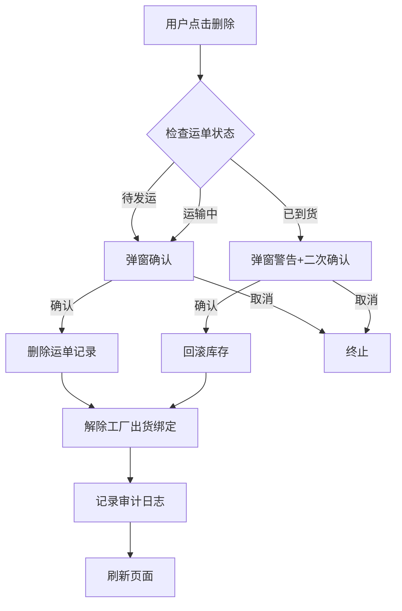

# 运单修改/删除全链路需求规格

**版本:** 1.0.0
**日期:** 2025-12-10
**产品经理:** Claude Product Director

---

## 目录

1. [背景与目标](#1-背景与目标)
2. [业务场景](#2-业务场景)
3. [运单状态定义](#3-运单状态定义)
4. [核心需求](#4-核心需求)
5. [操作权限矩阵](#5-操作权限矩阵)
6. [修改规则](#6-修改规则)
7. [删除规则](#7-删除规则)
8. [撤销状态功能](#8-撤销状态功能)
9. [中文提示语设计](#9-中文提示语设计)
10. [数据完整性保障](#10-数据完整性保障)
11. [验收标准](#11-验收标准)

---

## 1. 背景与目标

### 1.1 当前问题

**现状限制:**
- 已到货运单（`actual_arrival_date` 有值）完全无法删除
- 已发运运单（`actual_departure_date` 有值）无法删除
- 用户修改运单信息时缺乏清晰的字段级权限控制
- 错误提示语为英文，用户体验差
- 无法撤销已确认的状态（如误操作标记到货）

**业务影响:**
1. **数据纠错成本高**: 当运单信息录入错误时，用户无法自主修正，需要技术团队介入
2. **灵活性不足**: 实际业务中存在"取消到货"、"延后发运"等合理需求
3. **库存误差风险**: 已到货运单删除时，库存未回滚，导致账实不符
4. **用户体验差**: 英文报错信息，操作不可预期

### 1.2 目标

**核心价值:**
- **业务价值最大化**: 允许用户在各状态下灵活修改/删除运单，降低人工干预成本
- **数据一致性保障**: 删除/撤销操作必须保证库存、资金等下游数据的完整性
- **用户体验提升**: 全中文提示，清晰说明操作后果和限制条件

**成功指标:**
- 用户可自主修正 90% 以上的运单数据错误
- 删除/撤销操作后，系统数据零误差（通过自动化测试验证）
- 操作提示清晰度评分 ≥ 4.5/5.0（用户反馈）

---

## 2. 业务场景

### 2.1 修改场景

| 场景 | 用户角色 | 触发条件 | 预期结果 |
|------|---------|---------|---------|
| **场景 1: 修改运单号** | 物流专员 | 录入时手误，运单号错误 | 允许修改，不影响货物跟踪 |
| **场景 2: 调整预计到货日** | 供应链主管 | 物流延误，需调整计划 | 允许修改，同步更新库存预测 |
| **场景 3: 更新实际开船日** | 物流专员 | 船期延后 | 允许修改，已发运运单可修改 |
| **场景 4: 修改费用信息** | 财务人员 | 账单核对后发现金额错误 | 允许修改，已到货运单也可修改费用 |
| **场景 5: 修改目的仓库** | 物流主管 | 仓库变更 | 待发运可修改；已发运需警告；已到货不可修改（库存已入账） |

### 2.2 删除场景

| 场景 | 用户角色 | 触发条件 | 预期结果 |
|------|---------|---------|---------|
| **场景 1: 删除待发运单** | 物流专员 | 计划取消 | 直接删除，释放工厂出货绑定 |
| **场景 2: 删除已发运单** | 物流主管 | 运单重复录入 | 允许删除，释放工厂出货绑定 |
| **场景 3: 删除已到货运单** | 供应链主管 | 到货记录错误 | 允许删除，但需回滚库存并记录审计日志 |

### 2.3 撤销场景

| 场景 | 用户角色 | 触发条件 | 预期结果 |
|------|---------|---------|---------|
| **场景 1: 撤销到货** | 仓库管理员 | 误操作标记到货 | 撤销 `actual_arrival_date`，回滚库存增量 |
| **场景 2: 撤销发运** | 物流专员 | 货物未实际发运 | 撤销 `actual_departure_date`，状态回归"待发运" |

---

## 3. 运单状态定义

### 3.1 状态判定逻辑

运单状态由 **日期字段** 决定，无需新增 `status` 列：

| 状态名称 | 判定条件 | 中文显示 | 英文标识 |
|---------|---------|---------|---------|
| **待发运** | `actual_departure_date IS NULL` | 待发运 | `pending` |
| **已发运/运输中** | `actual_departure_date IS NOT NULL` AND `actual_arrival_date IS NULL` | 运输中 | `in_transit` |
| **已到货** | `actual_arrival_date IS NOT NULL` | 已到货 | `arrived` |

### 3.2 状态转换规则


**业务规则:**
1. **正向流转**: 待发运 → 运输中 → 已到货（标准流程）
2. **撤销允许**: 已到货 → 运输中（撤销到货）；运输中 → 待发运（撤销发运）
3. **删除特殊处理**: 已到货运单删除时，必须先回滚库存

---

## 4. 核心需求

### 4.1 功能需求 (Functional Requirements)

| 编号 | 需求描述 | 优先级 |
|------|---------|--------|
| **FR-1** | 支持运单在 **所有状态** 下修改非关键字段（如备注、费用） | P0 |
| **FR-2** | 支持运单在 **待发运** 状态下删除，且不影响关联的工厂出货记录 | P0 |
| **FR-3** | 支持运单在 **已发运** 状态下删除，解除与工厂出货的绑定 | P0 |
| **FR-4** | 支持运单在 **已到货** 状态下删除，必须回滚库存并记录审计日志 | P0 |
| **FR-5** | 提供 **撤销到货** 功能，清空 `actual_arrival_date`，同时回滚库存 | P1 |
| **FR-6** | 提供 **撤销发运** 功能，清空 `actual_departure_date`，状态回退到"待发运" | P1 |
| **FR-7** | 所有操作提示使用 **标准中文**，清晰说明影响范围 | P0 |

### 4.2 非功能需求 (Non-Functional Requirements)

| 编号 | 需求描述 | 指标 |
|------|---------|------|
| **NFR-1** | **数据一致性**: 删除/撤销操作必须保证库存、财务数据完整性 | 100% 事务一致性 |
| **NFR-2** | **审计追踪**: 所有删除操作记录到 `shipment_deletion_audit_log` | 100% 覆盖 |
| **NFR-3** | **操作原子性**: 删除+库存回滚必须在同一事务中完成 | 失败自动回滚 |
| **NFR-4** | **性能**: 删除操作响应时间 < 2s（包含库存回滚） | P95 < 2s |

---

## 5. 操作权限矩阵

### 5.1 字段级修改权限

以下矩阵定义了 **不同状态下允许修改的字段**：

| 字段名称 | 中文说明 | 待发运 | 运输中 | 已到货 | 业务原因 |
|---------|---------|:-----:|:-----:|:-----:|---------|
| **tracking_number** | 运单号 | ✅ | ✅ | ⚠️ | 已到货后修改会导致追溯混乱，需二次确认 |
| **destination_warehouse_id** | 目的仓库 | ✅ | ⚠️ | ❌ | 已到货后库存已入账，不可修改 |
| **logistics_plan** | 物流方案 | ✅ | ✅ | ✅ | 纯描述信息，随时可改 |
| **logistics_region** | 物流区域 | ✅ | ✅ | ✅ | 纯描述信息，随时可改 |
| **planned_departure_date** | 预计开船日 | ✅ | ✅ | ✅ | 计划日期，不影响实际业务 |
| **actual_departure_date** | 实际开船日 | ✅ | ✅ | ⚠️ | 已到货后修改需警告（影响运输时效统计） |
| **planned_arrival_date** | 预计到货日 | ✅ | ✅ | ✅ | 计划日期，不影响实际业务 |
| **actual_arrival_date** | 实际到货日 | ✅ | ✅ | ⚠️ | 已到货后修改需警告（影响库存入账日期） |
| **weight_kg** | 货物重量 | ✅ | ✅ | ✅ | 费用核算依据，可随时修正 |
| **cost_per_kg_usd** | 单价 | ✅ | ✅ | ✅ | 财务信息，对账后可修正 |
| **surcharge_usd** | 附加费 | ✅ | ✅ | ✅ | 财务信息，对账后可修正 |
| **tax_refund_usd** | 退税 | ✅ | ✅ | ✅ | 财务信息，对账后可修正 |
| **remarks** | 备注 | ✅ | ✅ | ✅ | 纯文本，随时可改 |
| **货物明细** (shipment_items) | SKU/数量 | ❌ | ❌ | ❌ | **不允许修改**，需删除重建 |

**图例说明:**
- ✅ **允许**: 直接修改
- ⚠️ **需确认**: 允许修改，但需弹窗二次确认并说明影响
- ❌ **禁止**: 不允许修改

### 5.2 删除权限

| 状态 | 是否可删除 | 前置条件 | 后置操作 |
|------|:---------:|---------|---------|
| **待发运** | ✅ | 无 | 删除运单记录，解除工厂出货绑定（`delivery_shipment_allocations`） |
| **运输中** | ✅ | 无 | 删除运单记录，解除工厂出货绑定 |
| **已到货** | ✅ | 需二次确认 | 1. 回滚库存（减去已入库数量）<br>2. 删除运单记录<br>3. 记录审计日志 |

---

## 6. 修改规则

### 6.1 修改分类

运单修改分为 **4 个类别**，每个类别有不同的业务规则：

#### 6.1.1 基本信息修改

**字段范围:**
- `tracking_number` (运单号)
- `logistics_plan` (物流方案)
- `logistics_region` (物流区域)
- `remarks` (备注)

**规则:**
- **待发运**: 无限制修改
- **运输中**: 无限制修改
- **已到货**:
  - `tracking_number` 修改需二次确认（弹窗提示："修改运单号可能影响物流追溯，是否继续？"）
  - 其他字段无限制

#### 6.1.2 日期信息修改

**字段范围:**
- `planned_departure_date` (预计开船日)
- `actual_departure_date` (实际开船日)
- `planned_arrival_date` (预计到货日)
- `actual_arrival_date` (实际到货日)

**规则:**
- **计划日期**（`planned_*`）: 所有状态下均可修改
- **实际日期**（`actual_*`）:
  - **待发运**: 可修改（通常为空）
  - **运输中**: 可修改 `actual_departure_date`
  - **已到货**: 修改 `actual_arrival_date` 需二次确认（弹窗提示："修改到货日期会影响库存入账时间和财务统计，是否继续？"）

**特殊规则:**
- 修改 `actual_arrival_date` 时，如果从有值改为 NULL，相当于"撤销到货"，需触发库存回滚
- 修改 `actual_departure_date` 时，如果从有值改为 NULL，相当于"撤销发运"

#### 6.1.3 费用信息修改

**字段范围:**
- `weight_kg` (货物重量)
- `cost_per_kg_usd` (单价)
- `surcharge_usd` (附加费)
- `tax_refund_usd` (退税)

**规则:**
- **所有状态**: 均可修改（财务对账后需要修正）
- 修改后自动重新计算 `total_cost_usd` (计算字段)

#### 6.1.4 目的仓库修改

**字段范围:**
- `destination_warehouse_id` (目的仓库)

**规则:**
- **待发运**: 可修改
- **运输中**: 可修改，但需二次确认（弹窗提示："货物已在途，修改目的仓库可能导致配送错误，是否继续？"）
- **已到货**: **禁止修改**（库存已入账到原仓库，修改会导致数据错乱）

### 6.2 货物明细修改规则

**限制说明:**
- **货物明细**（`shipment_items` 表）在运单创建后 **不可修改**
- 原因: 货物明细与工厂出货记录（`delivery_shipment_allocations`）绑定，修改会导致数据不一致

**解决方案:**
如需修改货物明细，用户需:
1. 删除当前运单（按删除规则执行）
2. 创建新运单，重新选择工厂出货和数量

---

## 7. 删除规则

### 7.1 删除流程



### 7.2 删除前置检查

| 检查项 | 检查逻辑 | 失败处理 |
|-------|---------|---------|
| **运单存在性** | 查询 `shipments` 表，`id = ?` | 提示: "运单不存在" |
| **关联货物检查** | 查询 `delivery_shipment_allocations` 表，获取关联数量 | 展示在确认弹窗中 |
| **库存影响检查** | 如果已到货，查询 `inventory_snapshots` 表，检查目标仓库当前库存 | 展示在确认弹窗中 |

### 7.3 删除确认弹窗设计

#### 7.3.1 待发运/运输中运单

**弹窗标题**: 确认删除运单

**弹窗内容**:
```
您即将删除运单: {tracking_number}

删除后将产生以下影响:
1. 解除与 {N} 条工厂出货记录的绑定
2. 这些工厂出货将回归"未发运"状态，可重新分配
3. 此操作不可恢复，但不影响库存数据

是否确认删除？
```

**按钮**:
- 取消 (灰色)
- 确认删除 (红色)

#### 7.3.2 已到货运单

**弹窗标题**: 删除已到货运单（需谨慎操作）

**弹窗内容**:
```
您即将删除已到货运单: {tracking_number}

删除后将产生以下影响:
1. 目的仓库 [{warehouse_name}] 的库存将减少:
   - SKU-A001: -500 件
   - SKU-B002: -300 件
   总计减少 800 件

2. 解除与 {N} 条工厂出货记录的绑定
3. 系统将记录本次删除操作的审计日志

⚠️ 警告: 此操作将直接修改库存数据，请确认库存账目无误后再执行。

是否确认删除？
```

**输入框**:
- 必填字段: "删除原因"（文本框，最少 10 字）

**按钮**:
- 取消 (灰色)
- 确认删除 (红色，需填写删除原因后才能点击)

### 7.4 删除后置操作

#### 7.4.1 待发运/运输中运单

**数据库操作顺序**:
```sql
BEGIN TRANSACTION;

-- 1. 删除工厂出货绑定
DELETE FROM delivery_shipment_allocations WHERE shipment_id = ?;

-- 2. 删除货物明细
DELETE FROM shipment_items WHERE shipment_id = ?;

-- 3. 删除运单主记录
DELETE FROM shipments WHERE id = ?;

-- 4. 记录审计日志
INSERT INTO shipment_deletion_audit_log (
  shipment_id, tracking_number, deleted_by, deletion_reason,
  shipment_snapshot, deleted_at
) VALUES (...);

COMMIT;
```

**触发器自动执行**:
- 工厂出货记录的 `shipped_qty` 自动减少（由 `update_delivery_shipment_status()` 触发器处理）
- 工厂出货状态自动更新为 `unshipped` 或 `partial`

#### 7.4.2 已到货运单

**数据库操作顺序**:
```sql
BEGIN TRANSACTION;

-- 1. 回滚库存 (减去已入库数量)
UPDATE inventory_snapshots
SET qty_on_hand = qty_on_hand - (
  SELECT shipped_qty FROM shipment_items WHERE shipment_id = ? AND sku = inventory_snapshots.sku
)
WHERE warehouse_id = ? AND sku IN (
  SELECT sku FROM shipment_items WHERE shipment_id = ?
);

-- 2. 删除工厂出货绑定
DELETE FROM delivery_shipment_allocations WHERE shipment_id = ?;

-- 3. 删除货物明细
DELETE FROM shipment_items WHERE shipment_id = ?;

-- 4. 删除运单主记录
DELETE FROM shipments WHERE id = ?;

-- 5. 记录审计日志（包含库存回滚信息）
INSERT INTO shipment_deletion_audit_log (
  shipment_id, tracking_number, deleted_by, deletion_reason,
  shipment_snapshot, inventory_rollback_details, deleted_at
) VALUES (...);

COMMIT;
```

**库存安全检查**:
- 删除前检查: `qty_on_hand - shipped_qty >= 0`
- 如果检查失败，阻止删除，提示: "删除失败: 目标仓库当前库存不足，无法回滚。请先调整库存后再试。"

---

## 8. 撤销状态功能

### 8.1 撤销到货

**触发入口**: 运单详情页 / 运单列表页操作菜单

**前置条件**:
- 运单状态为 **已到货** (`actual_arrival_date IS NOT NULL`)

**操作逻辑**:
```sql
BEGIN TRANSACTION;

-- 1. 回滚库存 (减去已入库数量)
UPDATE inventory_snapshots
SET qty_on_hand = qty_on_hand - (
  SELECT shipped_qty FROM shipment_items WHERE shipment_id = ? AND sku = inventory_snapshots.sku
)
WHERE warehouse_id = ? AND sku IN (
  SELECT sku FROM shipment_items WHERE shipment_id = ?
);

-- 2. 清空实际到货日期
UPDATE shipments SET actual_arrival_date = NULL WHERE id = ?;

-- 3. 记录操作日志
INSERT INTO shipment_status_change_log (
  shipment_id, action, performed_by, performed_at, remarks
) VALUES (?, 'revoke_arrival', ?, NOW(), '撤销到货');

COMMIT;
```

**确认弹窗**:
```
标题: 确认撤销到货

内容:
您即将撤销运单 {tracking_number} 的到货状态

撤销后将产生以下影响:
1. 运单状态回退至"运输中"
2. 目的仓库 [{warehouse_name}] 的库存将减少:
   - SKU-A001: -500 件
   - SKU-B002: -300 件
   总计减少 800 件

是否确认撤销？

按钮: [取消] [确认撤销]
```

### 8.2 撤销发运

**触发入口**: 运单详情页 / 运单列表页操作菜单

**前置条件**:
- 运单状态为 **运输中** (`actual_departure_date IS NOT NULL` AND `actual_arrival_date IS NULL`)

**操作逻辑**:
```sql
BEGIN TRANSACTION;

-- 1. 清空实际开船日期
UPDATE shipments SET actual_departure_date = NULL WHERE id = ?;

-- 2. 记录操作日志
INSERT INTO shipment_status_change_log (
  shipment_id, action, performed_by, performed_at, remarks
) VALUES (?, 'revoke_departure', ?, NOW(), '撤销发运');

COMMIT;
```

**确认弹窗**:
```
标题: 确认撤销发运

内容:
您即将撤销运单 {tracking_number} 的发运状态

撤销后将产生以下影响:
1. 运单状态回退至"待发运"
2. 不影响库存数据
3. 可重新设置发运日期

是否确认撤销？

按钮: [取消] [确认撤销]
```

---

## 9. 中文提示语设计

### 9.1 成功提示

| 操作 | 提示语 | 显示方式 |
|------|-------|---------|
| **创建运单** | 运单创建成功，运单号: {tracking_number} | Toast (绿色) |
| **修改运单** | 运单信息已更新 | Toast (绿色) |
| **删除运单** | 运单已删除，相关工厂出货已释放 | Toast (绿色) |
| **删除已到货运单** | 运单已删除，库存已回滚 (SKU-A001: -500件, SKU-B002: -300件) | Toast (绿色) |
| **撤销到货** | 已撤销到货状态，库存已回滚，运单状态已回退至"运输中" | Toast (绿色) |
| **撤销发运** | 已撤销发运状态，运单状态已回退至"待发运" | Toast (绿色) |
| **标记发运** | 运单已标记为"运输中" | Toast (绿色) |
| **标记到货** | 运单已标记为"已到货"，库存已更新 | Toast (绿色) |

### 9.2 失败/阻止提示

| 场景 | 提示语 | 显示方式 |
|------|-------|---------|
| **运单不存在** | 运单不存在或已被删除 | Toast (红色) |
| **已到货运单删除时库存不足** | 删除失败: 目标仓库 [{warehouse_name}] 当前库存不足，无法回滚。<br>需要回滚: SKU-A001 -500件 (当前库存: 300件)<br>请先调整库存后再试。 | Alert Dialog |
| **修改已到货运单目的仓库** | 禁止修改: 该运单已到货，库存已入账至原仓库，无法修改目的仓库 | Toast (红色) |
| **货物明细修改** | 货物明细无法修改，如需调整请删除运单后重新创建 | Toast (红色) |
| **撤销到货时库存不足** | 撤销失败: 目标仓库库存不足，无法回滚 | Toast (红色) |
| **数据验证失败** | 数据验证失败: {具体字段} 不能为空 | Toast (红色) |
| **并发冲突** | 操作失败: 运单数据已被其他用户修改，请刷新后重试 | Alert Dialog |

### 9.3 确认对话框文案

参考 **7.3 删除确认弹窗设计** 和 **8.1/8.2 撤销确认弹窗**

### 9.4 操作指引

| 场景 | 指引文案 | 显示位置 |
|------|---------|---------|
| **运单列表为空** | 暂无运单数据，点击"创建发运单"开始添加 | 列表空状态 |
| **删除按钮悬停** | 删除运单（已到货运单删除时会回滚库存） | Tooltip |
| **撤销到货按钮悬停** | 撤销到货状态，库存将回滚，运单回退至"运输中" | Tooltip |
| **撤销发运按钮悬停** | 撤销发运状态，运单回退至"待发运" | Tooltip |
| **修改已到货运单提示** | 提示: 该运单已到货，部分字段（如目的仓库、货物明细）无法修改 | 编辑页顶部 Banner |

---

## 10. 数据完整性保障

### 10.1 事务一致性

**原则**: 所有涉及多表操作的删除/撤销操作必须使用数据库事务

**实现要求**:
```sql
BEGIN TRANSACTION;
-- 操作 1: 库存回滚
-- 操作 2: 删除关联表
-- 操作 3: 删除主表
-- 操作 4: 记录审计日志
COMMIT;
```

**失败回滚**: 任何一步失败，整个事务自动回滚

### 10.2 审计日志设计

**新增表: `shipment_deletion_audit_log`**

| 字段名 | 类型 | 说明 |
|-------|------|------|
| `id` | UUID | 主键 |
| `shipment_id` | UUID | 被删除的运单ID |
| `tracking_number` | TEXT | 运单号 |
| `shipment_snapshot` | JSONB | 运单删除前的完整数据快照 |
| `inventory_rollback_details` | JSONB | 库存回滚明细 (SKU, 回滚数量, 仓库) |
| `deleted_by` | UUID | 删除人 (用户ID) |
| `deleted_at` | TIMESTAMPTZ | 删除时间 |
| `deletion_reason` | TEXT | 删除原因 (用户填写) |
| `created_at` | TIMESTAMPTZ | 记录创建时间 |

**数据示例**:
```json
{
  "shipment_snapshot": {
    "tracking_number": "SHIP-2025-0123",
    "destination_warehouse_id": "uuid-warehouse-01",
    "actual_arrival_date": "2025-12-08",
    "total_cost_usd": 1500.00
  },
  "inventory_rollback_details": [
    {
      "sku": "SKU-A001",
      "rollback_qty": -500,
      "warehouse_id": "uuid-warehouse-01",
      "warehouse_name": "FBA-US-East"
    },
    {
      "sku": "SKU-B002",
      "rollback_qty": -300,
      "warehouse_id": "uuid-warehouse-01",
      "warehouse_name": "FBA-US-East"
    }
  ]
}
```

### 10.3 库存回滚校验

**校验逻辑**:
```sql
-- 检查库存是否足够回滚
SELECT
  sku,
  qty_on_hand,
  (SELECT shipped_qty FROM shipment_items WHERE shipment_id = ? AND sku = inventory_snapshots.sku) AS rollback_qty,
  qty_on_hand - (SELECT shipped_qty FROM shipment_items WHERE shipment_id = ? AND sku = inventory_snapshots.sku) AS remaining_qty
FROM inventory_snapshots
WHERE warehouse_id = ? AND sku IN (SELECT sku FROM shipment_items WHERE shipment_id = ?);

-- 如果 remaining_qty < 0，阻止删除
```

**错误提示**: 参考 **9.2 失败/阻止提示**

---

## 11. 验收标准

### 11.1 功能验收 (Acceptance Criteria)

采用 **Gherkin 格式** 定义验收标准：

#### 场景 1: 删除待发运运单

```gherkin
Feature: 删除待发运运单

  Scenario: 成功删除待发运运单
    Given 存在一条待发运运单，运单号为 "SHIP-2025-0100"
    And 该运单绑定了 2 条工厂出货记录
    When 用户点击删除按钮
    And 用户在确认弹窗中点击"确认删除"
    Then 运单记录被删除
    And 2 条工厂出货记录的 shipped_qty 减少对应数量
    And 这 2 条工厂出货记录的状态更新为 "unshipped" 或 "partial"
    And 系统显示成功提示: "运单已删除，相关工厂出货已释放"
```

#### 场景 2: 删除已到货运单（库存充足）

```gherkin
Feature: 删除已到货运单

  Scenario: 成功删除已到货运单并回滚库存
    Given 存在一条已到货运单，运单号为 "SHIP-2025-0200"
    And 该运单的目的仓库为 "FBA-US-East"
    And 该运单包含货物: SKU-A001 500件, SKU-B002 300件
    And 目的仓库当前库存: SKU-A001 1000件, SKU-B002 500件
    When 用户点击删除按钮
    And 用户在确认弹窗中填写删除原因: "到货记录错误"
    And 用户点击"确认删除"
    Then 运单记录被删除
    And 目的仓库库存更新为: SKU-A001 500件, SKU-B002 200件
    And 审计日志记录包含: 删除人、删除时间、删除原因、库存回滚明细
    And 系统显示成功提示: "运单已删除，库存已回滚 (SKU-A001: -500件, SKU-B002: -300件)"
```

#### 场景 3: 删除已到货运单（库存不足，阻止删除）

```gherkin
Feature: 删除已到货运单时库存不足

  Scenario: 库存不足，阻止删除
    Given 存在一条已到货运单，运单号为 "SHIP-2025-0201"
    And 该运单的目的仓库为 "FBA-US-East"
    And 该运单包含货物: SKU-A001 500件
    And 目的仓库当前库存: SKU-A001 300件（不足）
    When 用户点击删除按钮
    And 用户在确认弹窗中填写删除原因并点击"确认删除"
    Then 删除操作被阻止
    And 系统显示错误提示: "删除失败: 目标仓库 [FBA-US-East] 当前库存不足，无法回滚。需要回滚: SKU-A001 -500件 (当前库存: 300件)。请先调整库存后再试。"
```

#### 场景 4: 撤销到货

```gherkin
Feature: 撤销到货状态

  Scenario: 成功撤销到货
    Given 存在一条已到货运单，运单号为 "SHIP-2025-0300"
    And 该运单的实际到货日期为 "2025-12-08"
    And 目的仓库库存已更新
    When 用户点击"撤销到货"按钮
    And 用户在确认弹窗中点击"确认撤销"
    Then 运单的 actual_arrival_date 被清空
    And 运单状态回退至"运输中"
    And 目的仓库库存回滚（减去对应数量）
    And 系统显示成功提示: "已撤销到货状态，库存已回滚，运单状态已回退至'运输中'"
```

#### 场景 5: 撤销发运

```gherkin
Feature: 撤销发运状态

  Scenario: 成功撤销发运
    Given 存在一条运输中运单，运单号为 "SHIP-2025-0400"
    And 该运单的实际开船日期为 "2025-12-05"
    And 该运单尚未到货
    When 用户点击"撤销发运"按钮
    And 用户在确认弹窗中点击"确认撤销"
    Then 运单的 actual_departure_date 被清空
    And 运单状态回退至"待发运"
    And 系统显示成功提示: "已撤销发运状态，运单状态已回退至'待发运'"
```

#### 场景 6: 修改已到货运单的目的仓库（阻止）

```gherkin
Feature: 修改已到货运单的目的仓库

  Scenario: 阻止修改已到货运单的目的仓库
    Given 存在一条已到货运单，运单号为 "SHIP-2025-0500"
    And 该运单的目的仓库为 "FBA-US-East"
    When 用户尝试修改目的仓库为 "FBA-US-West"
    Then 修改操作被阻止
    And 系统显示错误提示: "禁止修改: 该运单已到货，库存已入账至原仓库，无法修改目的仓库"
```

#### 场景 7: 修改费用信息（所有状态允许）

```gherkin
Feature: 修改运单费用信息

  Scenario: 修改已到货运单的费用信息
    Given 存在一条已到货运单，运单号为 "SHIP-2025-0600"
    And 当前运费单价为 10.00 USD/kg
    When 用户修改运费单价为 12.00 USD/kg
    And 用户点击"保存"
    Then 运单的 cost_per_kg_usd 更新为 12.00
    And 系统自动重新计算 total_cost_usd
    And 系统显示成功提示: "运单信息已更新"
```

### 11.2 非功能验收

| 验收项 | 验收标准 | 测试方法 |
|-------|---------|---------|
| **数据一致性** | 删除/撤销操作后，库存与运单数据 100% 一致 | 自动化测试 + 手工核对 |
| **审计追踪** | 100% 的删除操作记录到审计日志 | 数据库查询验证 |
| **事务原子性** | 删除失败时，所有数据回滚 | 模拟失败场景测试 |
| **性能** | 删除操作响应时间 P95 < 2s | 性能测试工具 |
| **提示语正确性** | 所有提示语为中文，无英文残留 | UI 测试 |

---

## 附录

### A. 数据库表设计参考

**运单主表: `shipments`**
```sql
CREATE TABLE shipments (
  id UUID PRIMARY KEY,
  tracking_number TEXT NOT NULL UNIQUE,
  destination_warehouse_id UUID NOT NULL REFERENCES warehouses(id),
  planned_departure_date DATE,
  actual_departure_date DATE,        -- 实际开船日（判定"运输中"状态）
  planned_arrival_date DATE,
  actual_arrival_date DATE,          -- 实际到货日（判定"已到货"状态）
  -- 其他字段...
);
```

**工厂出货-运单绑定表: `delivery_shipment_allocations`**
```sql
CREATE TABLE delivery_shipment_allocations (
  id UUID PRIMARY KEY,
  delivery_id UUID NOT NULL REFERENCES production_deliveries(id) ON DELETE RESTRICT,
  shipment_id UUID NOT NULL REFERENCES shipments(id) ON DELETE RESTRICT,
  shipped_qty INTEGER NOT NULL CHECK (shipped_qty > 0),
  -- 其他字段...
  UNIQUE (delivery_id, shipment_id)
);
```

**审计日志表: `shipment_deletion_audit_log`** (新增)
```sql
CREATE TABLE shipment_deletion_audit_log (
  id UUID PRIMARY KEY DEFAULT gen_random_uuid(),
  shipment_id UUID NOT NULL,
  tracking_number TEXT NOT NULL,
  shipment_snapshot JSONB NOT NULL,
  inventory_rollback_details JSONB,
  deleted_by UUID REFERENCES auth.users(id),
  deleted_at TIMESTAMPTZ DEFAULT NOW(),
  deletion_reason TEXT,
  created_at TIMESTAMPTZ DEFAULT NOW()
);
```

### B. 状态变更日志表 (新增)

**表名: `shipment_status_change_log`**
```sql
CREATE TABLE shipment_status_change_log (
  id UUID PRIMARY KEY DEFAULT gen_random_uuid(),
  shipment_id UUID NOT NULL REFERENCES shipments(id) ON DELETE CASCADE,
  action TEXT NOT NULL,  -- 'revoke_arrival', 'revoke_departure', 'mark_departed', 'mark_arrived'
  performed_by UUID REFERENCES auth.users(id),
  performed_at TIMESTAMPTZ DEFAULT NOW(),
  remarks TEXT,
  created_at TIMESTAMPTZ DEFAULT NOW()
);
```

---

**文档版本历史:**
- v1.0.0 (2025-12-10): 初始版本，定义完整需求规格

**审阅者签名:**
- 产品经理: Claude Product Director
- 业务顾问: [待定]
- 技术负责人: [待定]
