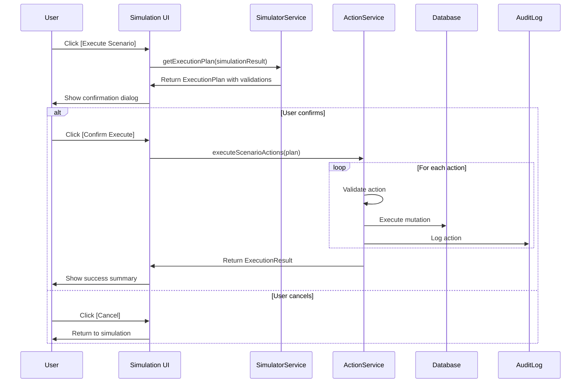

# Rolloy SCM V3 - Simulation & Decision Engine
# Product Requirements Document (PRD)

**Document Version:** 3.0.0
**Author:** Product Director
**Created Date:** 2025-12-14
**Status:** Draft for System Architect Review
**Priority Classification:** P0 (Core System Upgrade)
**Codename:** "Palantir" Upgrade

---

## 1. Executive Summary

### 1.1 Vision Statement

Transform Rolloy SCM from a **Record System** (ERP) into an **Intelligent Decision OS** inspired by Palantir Foundry. The V3 upgrade introduces three strategic pillars:

1. **The Ontology Layer** - Constraint-based business logic modeling
2. **The Simulation Engine** - What-If analysis playground
3. **The System of Action** - Direct execution from simulation results

### 1.2 Problem Statement

**Current State (V2):**
- The system calculates inventory projections and replenishment suggestions
- All calculations use fixed parameters (lead times, shipping modes)
- Users cannot preview the impact of decisions BEFORE committing
- No mechanism to compare alternative scenarios

**Business Pain Points:**

| Pain Point | Impact | Current Workaround |
|------------|--------|-------------------|
| Cannot simulate shipping mode changes | Poor cash flow planning | Manual Excel calculations |
| No visibility into capital constraints | Budget overruns, cash crunches | Monthly finance meetings |
| Unable to model demand spikes | Reactive rather than proactive | Emergency air freight |
| No SKU prioritization framework | Equal treatment of Hero vs Accessory SKUs | Manual intervention |

**Success Vision:**
> "As Tony (CEO), I want to click 'Simulate' on a 20% sales lift scenario, instantly see the cash flow and inventory impact, and if it looks good, click 'Execute' to generate the required POs - all in under 60 seconds."

### 1.3 Strategic Value Proposition

| Benefit | Quantified Impact | Measurement Method |
|---------|------------------|-------------------|
| **Faster Decision Cycles** | 80% reduction in planning time | Time from question to action |
| **Capital Efficiency** | 15% improvement in working capital | Cash conversion cycle |
| **Stockout Prevention** | 90% reduction for Hero SKUs | Zero-tolerance monitoring |
| **Risk Visibility** | 100% scenario coverage | Pre-decision simulation rate |

---

## 2. User Personas & Stories

### 2.1 Primary User Personas

#### Persona A: Tony (CEO / Business Owner)

**Profile:**
- **Role:** Strategic Decision Maker
- **Technical Level:** Low (business-focused)
- **Primary Concern:** Cash flow, business growth, risk management
- **Interaction Frequency:** Weekly strategic reviews

**Goals:**
1. Understand financial impact of supply chain decisions
2. Balance growth opportunities against capital constraints
3. Ensure Hero SKUs never stock out

**Frustrations:**
- "I don't know if I can afford to order more inventory this month"
- "Switching to air freight - how much will it really cost me?"
- "What happens to cash flow if sales spike 30% next month?"

---

#### Persona B: Operations Manager (Ops Manager)

**Profile:**
- **Role:** Day-to-day Supply Chain Execution
- **Technical Level:** Medium
- **Primary Concern:** Lead times, inventory levels, logistics optimization
- **Interaction Frequency:** Daily

**Goals:**
1. Optimize shipping routes and modes
2. Balance lead time vs cost tradeoffs
3. Ensure adequate safety stock

**Frustrations:**
- "I need to see what happens if I switch PO#123 from sea to air"
- "How does a 2-week production delay cascade through the supply chain?"
- "Can I consolidate shipments without stockout risk?"

---

#### Persona C: Demand Planner (Analyst)

**Profile:**
- **Role:** Forecast Management & Analysis
- **Technical Level:** High
- **Primary Concern:** Forecast accuracy, demand scenarios
- **Interaction Frequency:** Weekly

**Goals:**
1. Model demand variability scenarios
2. Test forecast adjustments before committing
3. Communicate impact of forecast changes to stakeholders

**Frustrations:**
- "What if my forecast is 20% too low? What's the recovery plan?"
- "How do different SKU tiers respond to demand shocks?"
- "I need to show leadership the best-case and worst-case scenarios"

---

### 2.2 User Stories

#### Epic 1: Simulation Playground (What-If Analysis)

##### US-1.1: Basic Scenario Simulation

```
AS A Tony (CEO)
I WANT TO simulate the impact of a 20% sales lift on my cash flow
SO THAT I can decide whether to invest in additional inventory
```

**Acceptance Criteria (Gherkin):**

```gherkin
Given I am on the Simulation Playground page
And the current baseline shows:
  | Metric | Week 1 | Week 2 | Week 3 | Week 4 |
  | Cash Position | $100K | $95K | $90K | $85K |
  | Stock Level (SKU-A) | 500 | 450 | 400 | 350 |
When I adjust the "Sales Lift %" slider to +20%
And I click "Run Simulation"
Then the system should display a comparison view:
  | Metric | Baseline W4 | Scenario W4 | Delta |
  | Cash Position | $85K | $72K | -$13K |
  | Stock Level (SKU-A) | 350 | 230 | -120 |
And I should see a warning: "SKU-A enters Risk zone in Week 3 under this scenario"
And I should see a recommendation: "Consider ordering 200 additional units by Week 1"
```

**Priority:** P0 (Must-Have)

---

##### US-1.2: Shipping Mode Comparison

```
AS A Operations Manager
I WANT TO compare the impact of switching a specific PO from Sea Freight to Air Freight
SO THAT I can make informed logistics decisions
```

**Acceptance Criteria:**

```gherkin
Given PO#2025-001-A is currently set to Sea Freight (5 weeks transit)
And the PO contains 1,000 units of SKU-A valued at $50,000
When I open the "Shipping Mode Simulator" for PO#2025-001-A
And I select "Air Freight" (1 week transit) as the alternative
And I click "Compare Scenarios"
Then the system should display:
  """
  Scenario Comparison: PO#2025-001-A

  | Factor | Sea Freight (Baseline) | Air Freight (Alternative) | Delta |
  |--------|------------------------|---------------------------|-------|
  | Transit Time | 5 weeks | 1 week | -4 weeks |
  | Arrival Week | W12 | W8 | -4 weeks earlier |
  | Freight Cost | $2,500 | $15,000 | +$12,500 |
  | Stockout Risk | Risk in W10 | No Risk | Eliminated |
  | Cash Impact | -$52,500 (W12) | -$65,000 (W8) | -$12,500 earlier |

  Recommendation: Air Freight prevents stockout but costs $12,500 more.
  Break-even if lost sales would exceed $12,500.
  """
And I should have a button [Execute Air Freight Change] that updates the PO
```

**Priority:** P0 (Must-Have)

---

##### US-1.3: Capital Constraint Scenario

```
AS A Tony (CEO)
I WANT TO see which POs would be blocked if I set a monthly capital cap
SO THAT I can prioritize purchases within budget constraints
```

**Acceptance Criteria:**

```gherkin
Given my current planned POs for January total $120,000
And I set a Capital Constraint of $80,000/month for January
When I run the simulation
Then the system should display:
  """
  Capital Constraint Impact (January Cap: $80,000)

  Exceeding Budget By: $40,000

  Recommended Prioritization:
  1. [Hero SKU-A] PO#001 - $30,000 - INCLUDE (Critical, no stockout tolerance)
  2. [Hero SKU-B] PO#002 - $25,000 - INCLUDE (Critical, no stockout tolerance)
  3. [Standard SKU-C] PO#003 - $25,000 - INCLUDE (Risk if excluded)
  4. [Accessory SKU-D] PO#004 - $20,000 - DEFER (Can tolerate 2-week gap)
  5. [Accessory SKU-E] PO#005 - $20,000 - DEFER (Can tolerate 2-week gap)

  Within Budget: $80,000 (3 POs)
  Deferred: $40,000 (2 POs to February)

  Impact of Deferral:
  - SKU-D: Stock gap from W5-W7 (Low impact, accessory)
  - SKU-E: Stock gap from W6-W8 (Low impact, accessory)
  """
And I should have a button [Apply Prioritization] that defers the selected POs
```

**Priority:** P1 (Important)

---

##### US-1.4: Multi-Factor Scenario (Combined)

```
AS A Demand Planner
I WANT TO simulate multiple factors simultaneously (demand + lead time + constraints)
SO THAT I can model complex real-world scenarios
```

**Acceptance Criteria:**

```gherkin
Given I am on the Advanced Simulation panel
When I configure the following scenario:
  | Factor | Value |
  | Sales Lift | +30% |
  | Production Delay | +2 weeks |
  | Shipping Mode | All to Air Freight |
  | Capital Cap | $100K/month |
  | SKU Scope | Hero SKUs only |
And I click "Run Full Simulation"
Then the system should display:
  1. 12-week inventory projection curves (Baseline vs Scenario)
  2. 12-week cash flow projection curves (Baseline vs Scenario)
  3. Stockout risk timeline for each SKU
  4. Total additional capital required
  5. Recommended action plan (prioritized POs)
And I should be able to export this as a PDF report
```

**Priority:** P2 (Nice-to-Have)

---

#### Epic 2: Constraint Modeling (Ontology Layer)

##### US-2.1: Define SKU Tiers

```
AS A Tony (CEO)
I WANT TO classify SKUs into tiers (Hero, Standard, Accessory)
SO THAT the system applies different service levels automatically
```

**Acceptance Criteria:**

```gherkin
Given I am on the Product Master settings page
When I add a new field "SKU Tier" with values:
  | Tier | Service Level | Stockout Tolerance |
  | Hero | 99% | 0 days (never stock out) |
  | Standard | 95% | 7 days acceptable |
  | Accessory | 85% | 14 days acceptable |
And I classify SKU-A-001 as "Hero"
And I classify SKU-B-002 as "Accessory"
Then the Simulation Engine should:
  1. Flag Hero SKU stockouts as CRITICAL
  2. Flag Accessory SKU stockouts as ACCEPTABLE (within tolerance)
  3. Prioritize Hero SKUs in capital-constrained scenarios
  4. Generate alerts only for out-of-tolerance stockouts
```

**Priority:** P0 (Must-Have)

---

##### US-2.2: Define Capital Constraints

```
AS A Tony (CEO)
I WANT TO set monthly capital budgets for procurement
SO THAT the system respects my cash flow limits
```

**Acceptance Criteria:**

```gherkin
Given I am on the Settings > Constraints page
When I define capital constraints:
  | Month | Budget Cap (USD) |
  | 2025-01 | 80,000 |
  | 2025-02 | 100,000 |
  | 2025-03 | 120,000 |
And I save the constraints
Then the Simulation Engine should:
  1. Highlight POs that would exceed monthly caps
  2. Suggest deferral strategies for over-budget scenarios
  3. Consider capital constraints in all simulations
  4. Display "Budget Utilization" gauge on dashboard
```

**Priority:** P1 (Important)

---

##### US-2.3: Define Route-Specific Lead Times

```
AS A Operations Manager
I WANT TO configure different lead times for different shipping routes
SO THAT simulations reflect real-world logistics variability
```

**Acceptance Criteria:**

```gherkin
Given I am on the Settings > Logistics Routes page
When I define route configurations:
  | Origin | Destination | Mode | Transit Time | Cost/kg |
  | China | US-West | Sea | 4 weeks | $0.50 |
  | China | US-East | Sea | 6 weeks | $0.55 |
  | China | US-West | Air | 1 week | $5.00 |
  | China | US-East | Air | 1 week | $5.50 |
And I associate warehouse "FBA-LAX" with route "US-West"
And I associate warehouse "FBA-NYC" with route "US-East"
Then the Simulation Engine should:
  1. Use route-specific transit times for projections
  2. Apply +2 week adjustment for US-East destinations
  3. Calculate freight costs based on route and mode
  4. Allow per-shipment route override in simulations
```

**Priority:** P1 (Important)

---

#### Epic 3: System of Action (Write-Back)

##### US-3.1: Execute PO from Simulation

```
AS A Operations Manager
I WANT TO generate real POs directly from a simulation result
SO THAT I can act immediately on good scenarios
```

**Acceptance Criteria:**

```gherkin
Given I have run a simulation that recommends:
  | SKU | Suggested Order Qty | Order Deadline |
  | SKU-A-001 | 500 | 2025-01-15 |
  | SKU-B-002 | 300 | 2025-01-17 |
When I click [Execute Scenario]
Then the system should display a confirmation dialog:
  """
  Ready to Generate Purchase Orders

  This action will create 2 new POs:

  PO#2025-01-15-001 (Auto-Generated)
  - SKU-A-001: 500 units @ $20/unit = $10,000
  - Order Date: 2025-01-15
  - Expected Delivery: 2025-02-19 (W08)

  PO#2025-01-17-001 (Auto-Generated)
  - SKU-B-002: 300 units @ $15/unit = $4,500
  - Order Date: 2025-01-17
  - Expected Delivery: 2025-02-21 (W08)

  Total Value: $14,500

  [ Cancel ]  [ Create Draft POs ]  [ Create & Confirm POs ]
  """
And clicking [Create & Confirm POs] should:
  1. Create the POs with status "Confirmed"
  2. Trigger forecast-order allocation automatically
  3. Update inventory projections
  4. Log the action in audit trail with scenario reference
```

**Priority:** P0 (Must-Have)

---

##### US-3.2: Execute Shipping Mode Change

```
AS A Operations Manager
I WANT TO change a shipment's shipping mode from the simulation result
SO THAT I can quickly respond to urgent situations
```

**Acceptance Criteria:**

```gherkin
Given simulation shows PO#2025-001-A should switch to Air Freight
When I click [Execute Air Freight Change]
Then the system should:
  1. Update the shipment record:
    - `logistics_plan = 'Air Freight'`
    - `planned_arrival_date = recalculated`
    - `cost_per_kg_usd = air rate`
  2. Recalculate inventory projections
  3. Update pending payables (increased logistics cost)
  4. Send notification: "Shipment {tracking} updated to Air Freight"
  5. Log change in audit trail with simulation reference
```

**Priority:** P1 (Important)

---

##### US-3.3: Bulk Defer POs for Capital Constraint

```
AS A Tony (CEO)
I WANT TO defer multiple POs at once based on the prioritization result
SO THAT I can quickly stay within budget
```

**Acceptance Criteria:**

```gherkin
Given the capital constraint simulation recommends deferring:
  - PO#004 to February
  - PO#005 to February
When I click [Apply Prioritization]
Then the system should:
  1. Update PO#004: `planned_order_date = 2025-02-01`
  2. Update PO#005: `planned_order_date = 2025-02-05`
  3. Recalculate inventory projections for affected SKUs
  4. Display warning if deferral creates stockout beyond tolerance
  5. Log bulk action in audit trail
And I should see a summary:
  """
  Deferral Complete

  2 POs deferred from January to February
  Capital saved in January: $40,000
  New January budget utilization: 100% ($80,000 / $80,000)

  Impact Assessment:
  - SKU-D: Acceptable gap (Accessory tier)
  - SKU-E: Acceptable gap (Accessory tier)

  No critical stockouts introduced.
  """
```

**Priority:** P1 (Important)

---

## 3. Data Visualization Requirements

### 3.1 Simulation Dashboard Layout

**Page Location:** `/simulation` or `/planning/simulation`

**Layout Structure:**

```
+---------------------------------------------------------------+
|  Simulation Playground                    [Reset] [Export PDF] |
+---------------------------------------------------------------+
|                                                                 |
|  +---------------------------+  +---------------------------+  |
|  | Scenario Controls         |  | Baseline vs Scenario      |  |
|  | (Left Panel - 30%)        |  | (Main View - 70%)         |  |
|  |                           |  |                           |  |
|  | [Sales Lift: ____%]       |  | [Tab: Inventory]          |  |
|  | [Shipping Mode: v]        |  | [Tab: Cash Flow]          |  |
|  | [Lead Time Adj: ___w]     |  | [Tab: Risk Map]           |  |
|  | [Capital Cap: $___]       |  |                           |  |
|  | [SKU Filter: v]           |  | +-------------------------+|  |
|  |                           |  | |                         ||  |
|  | [Run Simulation]          |  | |    CHART AREA           ||  |
|  |                           |  | |                         ||  |
|  | ----- Results -----       |  | +-------------------------+|  |
|  | Impact Summary            |  |                           |  |
|  | - Cash Delta: -$13K       |  | KPI Cards:                |  |
|  | - Stock Delta: -120       |  | [Stockout Risk] [Cash]... |  |
|  | - Risk Level: HIGH        |  |                           |  |
|  |                           |  | [Execute Scenario]        |  |
|  +---------------------------+  +---------------------------+  |
|                                                                 |
+---------------------------------------------------------------+
```

### 3.2 Chart Specifications

#### Chart 1: Cash Flow Projection (Area Chart)

**Chart Type:** Recharts `AreaChart` with dual series (Baseline + Scenario)

**Data Structure:**

```typescript
interface CashFlowDataPoint {
  week_iso: string           // "2025-W01"
  baseline_cash: number      // Baseline cash position (USD)
  scenario_cash: number      // Scenario cash position (USD)
  baseline_outflow: number   // Procurement + Logistics spend
  scenario_outflow: number
  capital_cap: number | null // If constraint enabled
}
```

**Visual Specifications:**
- X-Axis: ISO Weeks (12 weeks forward)
- Y-Axis: USD amount (formatted with K/M suffix)
- Baseline Series: Blue area (#3B82F6) with 50% opacity
- Scenario Series: Orange area (#F97316) with 50% opacity
- Capital Cap Line: Red dashed line (if enabled)
- Tooltip: Show week, both values, delta

**Aggregation Rules:**

```sql
-- Cash outflow calculation (procurement)
SELECT
  get_week_iso(planned_order_date) AS week_iso,
  SUM(ordered_qty * unit_price_usd) AS procurement_outflow
FROM purchase_order_items poi
JOIN purchase_orders po ON poi.po_id = po.id
WHERE planned_order_date BETWEEN current_date AND current_date + INTERVAL '12 weeks'
GROUP BY get_week_iso(planned_order_date);

-- Cash outflow calculation (logistics) - 30 days after arrival
SELECT
  get_week_iso(effective_arrival_date + INTERVAL '30 days') AS payment_week,
  SUM(total_cost_usd) AS logistics_outflow
FROM shipments
WHERE effective_arrival_date BETWEEN current_date AND current_date + INTERVAL '12 weeks'
GROUP BY get_week_iso(effective_arrival_date + INTERVAL '30 days');
```

---

#### Chart 2: Inventory Projection (Line Chart)

**Chart Type:** Recharts `LineChart` with multiple SKU series

**Data Structure:**

```typescript
interface InventoryProjectionDataPoint {
  week_iso: string
  sku: string
  baseline_stock: number
  scenario_stock: number
  safety_threshold: number
  stockout_threshold: 0  // Always 0
}
```

**Visual Specifications:**
- X-Axis: ISO Weeks (12 weeks)
- Y-Axis: Units
- Baseline: Solid line (per SKU color)
- Scenario: Dashed line (same color family, lighter)
- Safety Threshold: Yellow horizontal band
- Stockout Zone: Red horizontal band (below 0)
- Interactive: Click legend to toggle SKUs

**Color Palette (per SKU tier):**
- Hero SKUs: Red family (#EF4444, #DC2626, #B91C1C)
- Standard SKUs: Blue family (#3B82F6, #2563EB, #1D4ED8)
- Accessory SKUs: Gray family (#6B7280, #4B5563, #374151)

---

#### Chart 3: Risk Heatmap (Grid/Matrix)

**Chart Type:** Custom heatmap grid (Rows = SKUs, Columns = Weeks)

**Data Structure:**

```typescript
interface RiskHeatmapCell {
  sku: string
  week_iso: string
  stock_status: 'OK' | 'Risk' | 'Stockout'
  delta_vs_baseline: number      // Change from baseline
  sku_tier: 'Hero' | 'Standard' | 'Accessory'
  within_tolerance: boolean      // Based on tier settings
}
```

**Cell Color Logic:**

```typescript
function getCellColor(cell: RiskHeatmapCell): string {
  if (cell.stock_status === 'Stockout') {
    return cell.sku_tier === 'Hero' ? 'bg-red-600' : 'bg-red-400'
  }
  if (cell.stock_status === 'Risk') {
    return cell.within_tolerance ? 'bg-yellow-300' : 'bg-yellow-500'
  }
  return 'bg-green-400'
}
```

**Cell Content:**
```
+--------+
| 150    |  <- Closing stock
| -30    |  <- Delta vs baseline (red if negative)
+--------+
```

---

### 3.3 KPI Summary Cards

**Card Layout:** 4 cards in a row above the main chart

**Card Specifications:**

| Card # | Metric | Data Source | Visualization |
|--------|--------|-------------|---------------|
| 1 | **Cash Impact** | `SUM(scenario_outflow) - SUM(baseline_outflow)` | Number with +/- prefix, red if negative |
| 2 | **Stockout SKUs** | `COUNT(DISTINCT sku WHERE scenario_stock < 0)` | Number with arrow vs baseline |
| 3 | **Days of Stock** | `AVG(scenario_stock / weekly_sales)` | Number with delta |
| 4 | **Capital Utilization** | `SUM(scenario_spend) / capital_cap * 100` | Progress bar (red if >100%) |

**Card Component:**

```tsx
interface SimulationKPICard {
  title: string
  baseline_value: number
  scenario_value: number
  format: 'currency' | 'number' | 'percentage'
  delta_color_logic: 'positive_good' | 'negative_good'
}
```

---

## 4. Simulation Input Controls

### 4.1 Control Panel Specifications

**Location:** Left sidebar, collapsible

**Control Definitions:**

| Control | Type | Range | Default | Business Logic |
|---------|------|-------|---------|----------------|
| **Sales Lift %** | Slider | -50% to +100% | 0% | Multiplies all `forecast_qty` by `(1 + lift%)` |
| **Shipping Mode** | Dropdown | Sea / Air / Express | Per-shipment | Overrides `transit_time_weeks` |
| **Lead Time Adjustment** | Slider | -2w to +4w | 0w | Adds to `production_lead_weeks` |
| **Capital Cap** | Input | $0 - $500K | Disabled | Enables budget constraint |
| **Cap Period** | Select | Monthly / Quarterly | Monthly | Grouping for capital constraint |
| **SKU Scope** | Multi-select | Hero / Standard / Accessory | All | Filters simulation scope |
| **SKU Filter** | Searchable Select | All active SKUs | All | Specific SKU simulation |
| **Time Horizon** | Select | 12w / 26w / 52w | 12w | Simulation projection window |

**Shipping Mode Details:**

```typescript
interface ShippingModeOption {
  mode: 'Sea' | 'Air' | 'Express'
  transit_time_weeks: number
  cost_multiplier: number  // vs Sea freight
  display_name: string
}

const SHIPPING_MODES: ShippingModeOption[] = [
  { mode: 'Sea', transit_time_weeks: 5, cost_multiplier: 1.0, display_name: 'Sea Freight (5 weeks)' },
  { mode: 'Air', transit_time_weeks: 1, cost_multiplier: 10.0, display_name: 'Air Freight (1 week, 10x cost)' },
  { mode: 'Express', transit_time_weeks: 0.5, cost_multiplier: 20.0, display_name: 'Express Air (3 days, 20x cost)' }
]
```

### 4.2 Scenario Presets

**Purpose:** Quick-access common scenarios

**Preset Definitions:**

| Preset Name | Configuration | Use Case |
|-------------|---------------|----------|
| **Conservative** | -10% sales, +2w lead time | Recession planning |
| **Aggressive Growth** | +30% sales, Air freight | Peak season prep |
| **Cash Crunch** | $50K cap, defer Accessories | Liquidity crisis |
| **Supply Disruption** | +4w production lead time | Factory delay |
| **Peak Season** | +50% sales (Hero only) | Black Friday / Prime Day |

**Preset Button Row:**

```tsx
<div className="flex gap-2 mb-4">
  <Button variant="outline" size="sm" onClick={() => applyPreset('conservative')}>
    Conservative
  </Button>
  <Button variant="outline" size="sm" onClick={() => applyPreset('aggressive')}>
    Aggressive Growth
  </Button>
  {/* ... */}
</div>
```

---

## 5. Constraint Modeling Requirements (Ontology Layer)

### 5.1 SKU Tier System

**New Database Field:** `products.sku_tier`

```sql
ALTER TABLE products
  ADD COLUMN sku_tier TEXT NOT NULL DEFAULT 'Standard'
    CHECK (sku_tier IN ('Hero', 'Standard', 'Accessory'));
```

**Tier Definitions:**

| Tier | Service Level | Stockout Tolerance | Prioritization Weight |
|------|---------------|-------------------|----------------------|
| **Hero** | 99% | 0 days | Weight: 100 (highest) |
| **Standard** | 95% | 7 days | Weight: 50 |
| **Accessory** | 85% | 14 days | Weight: 10 (lowest) |

**Business Rules:**

| Rule ID | Condition | Behavior | Priority |
|---------|-----------|----------|----------|
| SKU-T-001 | Hero SKU projected stockout | Mark as CRITICAL, block scenario execution | P0 |
| SKU-T-002 | Accessory gap < 14 days | Mark as ACCEPTABLE, no warning | P1 |
| SKU-T-003 | Capital constraint active | Prioritize by tier weight, then by stockout date | P0 |

---

### 5.2 Capital Constraint System

**New Database Table:** `capital_constraints`

```sql
CREATE TABLE capital_constraints (
  id UUID PRIMARY KEY DEFAULT gen_random_uuid(),
  period_type TEXT NOT NULL CHECK (period_type IN ('monthly', 'quarterly')),
  period_key TEXT NOT NULL,           -- "2025-01" or "2025-Q1"
  budget_cap_usd NUMERIC(12,2) NOT NULL,
  is_active BOOLEAN NOT NULL DEFAULT true,
  created_at TIMESTAMPTZ NOT NULL DEFAULT NOW(),
  updated_at TIMESTAMPTZ NOT NULL DEFAULT NOW(),

  UNIQUE (period_type, period_key)
);

-- Example data
INSERT INTO capital_constraints (period_type, period_key, budget_cap_usd) VALUES
  ('monthly', '2025-01', 80000.00),
  ('monthly', '2025-02', 100000.00),
  ('monthly', '2025-03', 120000.00);
```

**Constraint Evaluation Logic:**

```typescript
interface CapitalConstraintResult {
  period: string                    // "2025-01"
  budget_cap: number                // 80000
  planned_spend: number             // 120000
  exceeds_cap: boolean              // true
  excess_amount: number             // 40000
  deferred_pos: DeferralSuggestion[]
  remaining_budget: number          // 0 (after prioritization)
}

interface DeferralSuggestion {
  po_id: string
  sku: string
  sku_tier: 'Hero' | 'Standard' | 'Accessory'
  amount_usd: number
  stockout_impact: StockoutImpact
  recommended_action: 'INCLUDE' | 'DEFER'
  defer_to_period: string | null
}
```

---

### 5.3 Route-Specific Lead Times

**New Database Table:** `logistics_routes`

```sql
CREATE TABLE logistics_routes (
  id UUID PRIMARY KEY DEFAULT gen_random_uuid(),
  route_code TEXT NOT NULL UNIQUE,    -- "CN-US-WEST-SEA"
  origin_country TEXT NOT NULL,       -- "CN"
  destination_region TEXT NOT NULL,   -- "US-West"
  shipping_mode TEXT NOT NULL,        -- "Sea" | "Air" | "Express"
  transit_time_weeks NUMERIC(4,1) NOT NULL,
  cost_per_kg_usd NUMERIC(8,4) NOT NULL,
  is_active BOOLEAN NOT NULL DEFAULT true,
  created_at TIMESTAMPTZ NOT NULL DEFAULT NOW(),
  updated_at TIMESTAMPTZ NOT NULL DEFAULT NOW()
);

-- Link warehouses to routes
ALTER TABLE warehouses
  ADD COLUMN default_route_id UUID REFERENCES logistics_routes(id);

-- Example data
INSERT INTO logistics_routes (route_code, origin_country, destination_region, shipping_mode, transit_time_weeks, cost_per_kg_usd) VALUES
  ('CN-US-WEST-SEA', 'CN', 'US-West', 'Sea', 4.0, 0.50),
  ('CN-US-EAST-SEA', 'CN', 'US-East', 'Sea', 6.0, 0.55),
  ('CN-US-WEST-AIR', 'CN', 'US-West', 'Air', 1.0, 5.00),
  ('CN-US-EAST-AIR', 'CN', 'US-East', 'Air', 1.0, 5.50),
  ('CN-EU-SEA', 'CN', 'Europe', 'Sea', 7.0, 0.60),
  ('CN-EU-AIR', 'CN', 'Europe', 'Air', 1.5, 6.00);
```

---

## 6. Simulation Engine Technical Requirements

### 6.1 Core Algorithm: SimulatorService

**Design Principle:** Stateless Calculator

The SimulatorService MUST NOT modify any database records. It receives "Scenario Parameters" and returns "Projected Results" as pure functions.

**Interface Definition:**

```typescript
interface ScenarioParameters {
  // Demand modifiers
  sales_lift_percent: number          // -50 to +100
  sku_scope: ('Hero' | 'Standard' | 'Accessory')[]

  // Lead time modifiers
  production_lead_adjustment_weeks: number  // -2 to +4
  shipping_mode_override: 'Sea' | 'Air' | 'Express' | null

  // Constraint toggles
  capital_constraint_enabled: boolean
  capital_cap_usd: number | null
  capital_period: 'monthly' | 'quarterly'

  // Scope
  sku_filter: string[] | null         // Specific SKUs or null for all
  time_horizon_weeks: 12 | 26 | 52
}

interface SimulationResult {
  // Comparison data
  baseline: WeeklyProjection[]
  scenario: WeeklyProjection[]

  // Delta analysis
  cash_impact_total: number
  stockout_count_delta: number
  days_of_stock_delta: number

  // Risk assessment
  critical_stockouts: StockoutEvent[]
  acceptable_gaps: StockoutEvent[]

  // Recommendations
  recommended_actions: RecommendedAction[]

  // Constraint results
  capital_analysis: CapitalConstraintResult | null

  // Metadata
  calculated_at: string
  parameters_hash: string             // For caching
}

interface WeeklyProjection {
  week_iso: string
  projections: SKUProjection[]
  cash_position: number
  cash_outflow: number
}

interface SKUProjection {
  sku: string
  sku_tier: 'Hero' | 'Standard' | 'Accessory'
  opening_stock: number
  arrival_qty: number
  sales_qty: number
  closing_stock: number
  stock_status: 'OK' | 'Risk' | 'Stockout'
  safety_threshold: number
}
```

### 6.2 Calculation Formulas

**Scenario Sales Calculation:**

```typescript
function calculateScenarioSales(
  baseline_forecast: number,
  sales_lift_percent: number
): number {
  return Math.round(baseline_forecast * (1 + sales_lift_percent / 100))
}
```

**Scenario Arrival Week Calculation:**

```typescript
function calculateScenarioArrivalWeek(
  order_week: string,
  production_lead_weeks: number,
  lead_time_adjustment: number,
  shipping_mode: 'Sea' | 'Air' | 'Express',
  route: LogisticsRoute
): string {
  const base_transit = route.transit_time_weeks
  const mode_transit = getTransitTimeByMode(shipping_mode)  // Override if different mode
  const effective_transit = shipping_mode === route.shipping_mode ? base_transit : mode_transit

  const total_lead_time =
    (production_lead_weeks + lead_time_adjustment) +  // Production
    1 +                                                // Loading buffer
    effective_transit +                                // Transit
    2                                                  // Inbound buffer

  return addWeeksToWeekString(order_week, total_lead_time)
}
```

**Cash Flow Projection:**

```typescript
function calculateCashFlow(
  projections: WeeklyProjection[],
  initial_cash: number
): CashFlowProjection[] {
  let running_cash = initial_cash

  return projections.map(week => {
    // Outflows this week
    const procurement_outflow = calculateProcurementOutflow(week)  // PO payments (60 days after delivery)
    const logistics_outflow = calculateLogisticsOutflow(week)      // Shipment payments (30 days after arrival)

    running_cash = running_cash - procurement_outflow - logistics_outflow

    return {
      week_iso: week.week_iso,
      cash_position: running_cash,
      procurement_outflow,
      logistics_outflow,
      total_outflow: procurement_outflow + logistics_outflow
    }
  })
}
```

**Capital Prioritization Algorithm:**

```typescript
function prioritizePOsWithinBudget(
  pos: PurchaseOrderCandidate[],
  budget_cap: number
): PrioritizationResult {
  // Sort by: tier weight DESC, stockout_date ASC
  const sorted = pos.sort((a, b) => {
    if (a.tier_weight !== b.tier_weight) {
      return b.tier_weight - a.tier_weight  // Higher weight first
    }
    return a.stockout_date.localeCompare(b.stockout_date)  // Earlier stockout first
  })

  let remaining_budget = budget_cap
  const included: PurchaseOrderCandidate[] = []
  const deferred: PurchaseOrderCandidate[] = []

  for (const po of sorted) {
    if (po.amount_usd <= remaining_budget) {
      included.push(po)
      remaining_budget -= po.amount_usd
    } else {
      deferred.push({
        ...po,
        defer_to_period: getNextPeriod(po.original_period)
      })
    }
  }

  return { included, deferred, remaining_budget }
}
```

### 6.3 Caching Strategy

**Cache Key Structure:**

```typescript
function generateCacheKey(params: ScenarioParameters): string {
  const normalized = {
    sales_lift: params.sales_lift_percent,
    mode: params.shipping_mode_override,
    lead_adj: params.production_lead_adjustment_weeks,
    cap: params.capital_constraint_enabled ? params.capital_cap_usd : null,
    skus: params.sku_filter?.sort().join(',') || 'ALL',
    horizon: params.time_horizon_weeks
  }
  return `sim:${hashObject(normalized)}`
}
```

**Cache TTL:**
- Simulation results: 5 minutes
- Baseline data: 1 hour
- Constraint definitions: Until modified

**Invalidation Triggers:**
- Any PO creation/update
- Any shipment update
- Forecast update
- Constraint definition change

---

## 7. Write-Back / Action Requirements

### 7.1 Action Types

| Action | Source | Target | Validation Required |
|--------|--------|--------|---------------------|
| **Create PO** | Simulation recommendation | `purchase_orders` + `purchase_order_items` | Budget check, stockout prevention |
| **Update Shipping Mode** | Mode comparison | `shipments.logistics_plan` | Cost approval if > threshold |
| **Defer PO** | Capital prioritization | `purchase_orders.planned_order_date` | Stockout tolerance check |
| **Bulk Update** | Multi-action scenario | Multiple tables | All individual validations |

### 7.2 Execution Flow



### 7.3 Audit Trail Requirements

**New Table: `simulation_executions`**

```sql
CREATE TABLE simulation_executions (
  id UUID PRIMARY KEY DEFAULT gen_random_uuid(),
  scenario_hash TEXT NOT NULL,                      -- Link to cached scenario
  scenario_params JSONB NOT NULL,                   -- Full parameters
  execution_type TEXT NOT NULL CHECK (execution_type IN ('CREATE_PO', 'UPDATE_SHIPMENT', 'DEFER_PO', 'BULK')),
  affected_records JSONB NOT NULL,                  -- Array of {table, id, action}
  executed_by UUID,                                 -- User ID (nullable for dev)
  executed_at TIMESTAMPTZ NOT NULL DEFAULT NOW(),
  rollback_available BOOLEAN NOT NULL DEFAULT true,
  rollback_executed_at TIMESTAMPTZ,
  rollback_executed_by UUID,
  created_at TIMESTAMPTZ NOT NULL DEFAULT NOW()
);

CREATE INDEX idx_sim_exec_hash ON simulation_executions(scenario_hash);
CREATE INDEX idx_sim_exec_date ON simulation_executions(executed_at);
```

**Audit Record Example:**

```json
{
  "scenario_hash": "a1b2c3d4e5f6",
  "scenario_params": {
    "sales_lift_percent": 20,
    "shipping_mode_override": "Air",
    "capital_constraint_enabled": true,
    "capital_cap_usd": 80000
  },
  "execution_type": "BULK",
  "affected_records": [
    {"table": "purchase_orders", "id": "uuid-001", "action": "CREATE"},
    {"table": "purchase_orders", "id": "uuid-002", "action": "CREATE"},
    {"table": "shipments", "id": "uuid-003", "action": "UPDATE", "field": "logistics_plan", "old": "Sea", "new": "Air"}
  ],
  "executed_by": "user-uuid-tony",
  "executed_at": "2025-01-15T10:30:00Z"
}
```

### 7.4 Rollback Capability

**Design:** Soft rollback within 24 hours

**Rollback Logic:**
1. Query `simulation_executions` for `rollback_available = true`
2. For each `affected_record`:
   - `CREATE` -> Soft delete (set `is_active = false` or `status = 'Cancelled'`)
   - `UPDATE` -> Revert to `old` value from audit
3. Mark execution as `rollback_executed_at = NOW()`

**Constraints:**
- Cannot rollback if downstream actions exist (e.g., delivery created for PO)
- Cannot rollback after 24 hours
- Requires confirmation dialog with impact preview

---

## 8. Success Metrics

### 8.1 Leading Indicators (Week 1-4)

| Metric | Target | Measurement Method |
|--------|--------|-------------------|
| Simulation Usage Rate | > 80% of planning sessions use simulation | Event tracking: `simulation_run` events |
| Scenario Diversity | > 3 different scenario types per week | Unique `scenario_params` combinations |
| Execute Rate | > 30% of simulations lead to execution | `simulation_executions` / `simulation_run` |
| Time to Decision | < 60 seconds from simulation to execute | `executed_at - simulation_start` |

### 8.2 Lagging Indicators (Month 2-6)

| Metric | Baseline | Target | Measurement |
|--------|----------|--------|-------------|
| **Planning Cycle Time** | 3 hours | < 30 minutes | User survey + time tracking |
| **Cash Flow Predictability** | 60% accuracy | > 85% accuracy | Projected vs actual cash position |
| **Hero SKU Stockouts** | 5 per quarter | 0 per quarter | `stock_status = 'Stockout'` for Hero tier |
| **Capital Utilization** | 65% | > 90% | Actual spend / budget cap |
| **Emergency Air Freight** | 15% of shipments | < 5% of shipments | Mode changes after initial planning |

### 8.3 User Satisfaction

**Survey Questions (Quarterly):**

1. "The Simulation Playground helps me make faster decisions" (1-5 scale)
2. "I trust the simulation results to accurately predict outcomes" (1-5 scale)
3. "The Execute function saves me significant manual work" (1-5 scale)

**Target:** Average score > 4.0 for all questions

---

## 9. Out of Scope (V3)

The following features are explicitly NOT included in V3:

| Feature | Reason | Future Consideration |
|---------|--------|---------------------|
| **AI-Powered Scenario Recommendations** | Requires ML training data | V4 |
| **Multi-Currency Cash Flow** | Current ops are USD-only | When expanding to EU |
| **Real-Time Inventory Sync** | No API integration with 3PLs | V4 with 3PL integration |
| **Supplier Negotiation Modeling** | Complex pricing models | V5 |
| **Scenario Sharing/Collaboration** | Single user system currently | V4 multi-user |
| **Mobile Simulation Interface** | Desktop-first priority | V4 responsive design |
| **Automated Scenario Triggering** | Need manual control first | V4 with confidence |
| **Monte Carlo Simulation** | Complexity vs value tradeoff | V5 advanced analytics |

---

## 10. Implementation Phases

### Phase 1: Foundation (Week 1-2)

**Deliverables:**
- [ ] Database schema changes (SKU tier, capital constraints, routes)
- [ ] SimulatorService core implementation
- [ ] Basic API endpoints for simulation

**Acceptance:**
- Can run single-factor simulation (sales lift only)
- Returns correct baseline vs scenario comparison

### Phase 2: UI & Visualization (Week 3-4)

**Deliverables:**
- [ ] Simulation Playground page layout
- [ ] Scenario controls component
- [ ] Cash flow chart (Recharts AreaChart)
- [ ] Inventory projection chart (Recharts LineChart)
- [ ] KPI summary cards

**Acceptance:**
- All controls functional
- Charts render correctly with mock data
- Responsive layout (desktop + tablet)

### Phase 3: Constraint Engine (Week 5-6)

**Deliverables:**
- [ ] SKU tier CRUD UI
- [ ] Capital constraint management UI
- [ ] Logistics routes configuration
- [ ] Constraint integration in SimulatorService

**Acceptance:**
- Capital constraint prioritization works correctly
- Route-specific lead times applied
- SKU tier filtering operational

### Phase 4: Write-Back & Actions (Week 7-8)

**Deliverables:**
- [ ] Execute scenario workflow
- [ ] Audit trail implementation
- [ ] Confirmation dialogs
- [ ] Rollback functionality

**Acceptance:**
- Can create POs from simulation
- Can update shipment modes
- Can defer POs with bulk action
- Full audit trail captured

### Phase 5: Polish & Documentation (Week 9-10)

**Deliverables:**
- [ ] Performance optimization (caching)
- [ ] Error handling & edge cases
- [ ] User documentation
- [ ] Admin guide for constraints

**Acceptance:**
- < 2 second simulation response time
- All error states handled gracefully
- Documentation complete

---

## 11. Risk Assessment

### 11.1 Technical Risks

| Risk | Impact | Probability | Mitigation |
|------|--------|-------------|-----------|
| Simulation performance bottleneck | High | Medium | Implement aggressive caching, limit time horizon |
| Data inconsistency after execute | High | Low | Transaction wrapping, rollback capability |
| Complex constraint interactions | Medium | High | Extensive unit testing, clear precedence rules |

### 11.2 Business Risks

| Risk | Impact | Probability | Mitigation |
|------|--------|-------------|-----------|
| Users don't trust simulation results | High | Medium | Show calculation transparency, validate against actuals |
| Over-reliance on automation | Medium | Low | Require confirmation, maintain audit trail |
| Constraint definitions incorrect | High | Medium | Default to conservative values, easy adjustment UI |

---

## 12. Glossary

| Term | Definition |
|------|------------|
| **Ontology Layer** | The constraint and rule definitions that govern business logic |
| **Scenario Parameters** | The input variables for a what-if simulation |
| **Write-Back** | The action of converting simulation results into actual database changes |
| **SKU Tier** | Classification of products by service level importance (Hero/Standard/Accessory) |
| **Capital Constraint** | Monthly or quarterly budget limit for procurement spend |
| **Time Horizon** | The number of weeks projected in a simulation (12/26/52) |
| **Baseline** | The current state projection without any scenario modifications |
| **Scenario** | The projected state with scenario parameters applied |
| **Execute Rate** | Percentage of simulations that result in actual actions |

---

## 13. Appendix: Sample API Contracts

### A1. Run Simulation Endpoint

```typescript
// POST /api/simulation/run
interface RunSimulationRequest {
  parameters: ScenarioParameters
}

interface RunSimulationResponse {
  success: boolean
  result: SimulationResult | null
  error: string | null
  cache_hit: boolean
  execution_time_ms: number
}
```

### A2. Execute Scenario Endpoint

```typescript
// POST /api/simulation/execute
interface ExecuteScenarioRequest {
  scenario_hash: string
  execution_type: 'CREATE_PO' | 'UPDATE_SHIPMENT' | 'DEFER_PO' | 'BULK'
  selected_actions: string[]  // IDs of recommended actions to execute
  confirmation_token: string  // From preview step
}

interface ExecuteScenarioResponse {
  success: boolean
  execution_id: string
  affected_records: AffectedRecord[]
  summary: {
    pos_created: number
    shipments_updated: number
    pos_deferred: number
  }
  error: string | null
}
```

### A3. Rollback Endpoint

```typescript
// POST /api/simulation/rollback
interface RollbackRequest {
  execution_id: string
  reason: string
}

interface RollbackResponse {
  success: boolean
  rolled_back_records: number
  error: string | null
}
```

---

## 14. Document Sign-Off

| Role | Name | Status | Date |
|------|------|--------|------|
| Product Director | Claude (AI) | Draft Complete | 2025-12-14 |
| System Architect | TBD | Pending Review | - |
| CEO (Stakeholder) | Tony | Pending Review | - |
| Frontend Artisan | TBD | Pending Review | - |
| Backend Specialist | TBD | Pending Review | - |
| QA Director | TBD | Pending Review | - |

---

**END OF DOCUMENT**

*This PRD defines the "Palantir" upgrade vision for Rolloy SCM V3. The next step is System Architect review to create the technical design document at `specs/v3-simulation-engine/design.md`.*
