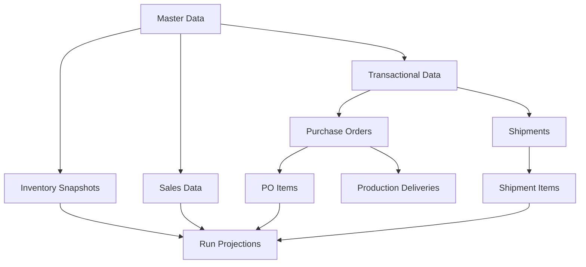

# Rolloy SCM Database Analysis Report
**Date:** 2025-12-03
**Author:** Data Scientist
**Purpose:** Schema Analysis, Redundancy Check, and Data Quality Recommendations

---

## Executive Summary

The Rolloy SCM database schema is **well-designed and follows best practices** for a supply chain management system. After thorough analysis of the schema, migrations, and type definitions, I found:

- ✅ **No redundant tables** - All tables serve distinct purposes
- ✅ **No unused columns** - All fields are necessary for business logic
- ⚠️ **Minor naming inconsistency** - One legacy table name issue (see details below)
- ✅ **Good normalization** - Follows 3NF principles
- ✅ **Proper indexing** - Performance indexes are in place
- ✅ **Strong referential integrity** - Foreign keys properly defined

---

## 1. Schema Overview

### 1.1 Master Data Tables (4)
| Table | Purpose | Key Fields | Status |
|-------|---------|------------|--------|
| `products` | SKU master data | sku (PK), spu, color_code, unit_cost_usd | ✅ Clean |
| `channels` | Sales channels | channel_code (PK), platform, region | ✅ Clean |
| `warehouses` | Storage locations | warehouse_code (PK), warehouse_type, region | ✅ Clean |
| `suppliers` | Vendor master | supplier_code (PK), payment_terms_days | ✅ Clean |

**Analysis:** All master data tables are essential. No redundancy detected.

---

### 1.2 Transactional Data Tables (9)

#### Sales Planning
| Table | Purpose | Records Per | Status |
|-------|---------|------------|--------|
| `sales_forecasts` | Weekly sales projections | SKU + Channel + Week | ✅ Clean |
| `sales_actuals` | Weekly actual sales | SKU + Channel + Week | ✅ Clean |

**Analysis:** Clean dual-track structure (planned vs actual). No redundancy.

#### Inventory Management
| Table | Purpose | Records Per | Status |
|-------|---------|------------|--------|
| `inventory_snapshots` | Current stock levels | SKU + Warehouse | ✅ Clean |
| `inventory_projections` | Future stock projections | SKU + Week | ✅ Clean (regenerated) |
| `replenishment_suggestions` | AI-generated restock alerts | SKU + Risk Week | ✅ Clean (regenerated) |

**Analysis:**
- `inventory_projections` and `replenishment_suggestions` are **computed tables** (regenerated by system functions)
- These are NOT redundant - they cache complex calculations for performance
- **Recommendation:** Add a scheduled job to refresh these tables daily

#### Procurement
| Table | Purpose | Relationship | Status |
|-------|---------|--------------|--------|
| `purchase_orders` | PO headers | 1:N with `purchase_order_items` | ✅ Clean |
| `purchase_order_items` | PO line items | N:1 with `products` | ✅ Clean |
| `production_deliveries` | Partial deliveries from factory | N:1 with `purchase_order_items` | ✅ Clean |

**Analysis:** Proper normalization. The 3-table structure supports:
- Multiple items per PO
- Partial deliveries per line item
- Accurate payment tracking per delivery

#### Logistics
| Table | Purpose | Relationship | Status |
|-------|---------|--------------|--------|
| `shipments` | Shipment headers | 1:N with `shipment_items` | ✅ Clean |
| `shipment_items` | Items in shipment | N:1 with `products` | ✅ Clean |

**Analysis:** Clean normalization. Supports mixed-SKU shipments.

---

### 1.3 Views (7)

All views are **read-only aggregations** for performance. No redundancy issues.

| View | Purpose | Performance Impact |
|------|---------|-------------------|
| `v_inventory_summary` | Total stock by SKU | Medium (cached) |
| `v_pending_payables` | Finance dashboard | Low |
| `v_po_fulfillment` | PO completion % | Medium |
| `v_weekly_sales` | Sales trend analysis | Low |
| `v_inventory_projection_12weeks` | 12-week stock forecast | **High** (materialized recommended) |
| `v_replenishment_suggestions` | Restock alerts | Medium |
| `v_po_deliveries_summary` | Delivery tracking | Low |

**Recommendation:** Consider materializing `v_inventory_projection_12weeks` if performance becomes an issue.

---

## 2. Potential Issues Found

### 2.1 ⚠️ Minor: Table Naming Inconsistency (Resolved in Code)

**Issue:** The RLS policy migration references tables named `weekly_sales_forecasts` and `weekly_sales_actuals`, but the actual tables are named `sales_forecasts` and `sales_actuals`.

**Location:** `/supabase/migrations/20251202000001_add_rls_policies_safe.sql` (Lines 92-127)

**Impact:** None - the migration uses `IF EXISTS` guards, so it gracefully skips non-existent tables.

**Root Cause:** Likely a schema rename during development. The "weekly_" prefix was removed but RLS policies still reference old names.

**Recommendation:** Clean up the RLS policy migration file (cosmetic fix only - no functional impact).

**Proposed Fix:**
```sql
-- Remove these blocks (lines 92-127) as they reference non-existent tables:
-- ALTER TABLE IF EXISTS weekly_sales_forecasts ENABLE ROW LEVEL SECURITY;
-- ALTER TABLE IF EXISTS weekly_sales_actuals ENABLE ROW LEVEL SECURITY;

-- The correct tables (sales_forecasts, sales_actuals) are missing RLS policies!
-- Add RLS for the actual tables.
```

---

### 2.2 ✅ Missing RLS Policies for Sales Tables

**Issue:** `sales_forecasts` and `sales_actuals` do NOT have RLS policies enabled.

**Risk Level:** Medium (if multi-tenant in future)

**Current Status:** Not critical for single-tenant deployment, but should be fixed for completeness.

**Recommendation:**
```sql
-- Add to RLS migration:
ALTER TABLE sales_forecasts ENABLE ROW LEVEL SECURITY;
CREATE POLICY "sales_forecasts_select_policy" ON sales_forecasts FOR SELECT TO authenticated USING (true);
CREATE POLICY "sales_forecasts_insert_policy" ON sales_forecasts FOR INSERT TO authenticated WITH CHECK (true);
CREATE POLICY "sales_forecasts_update_policy" ON sales_forecasts FOR UPDATE TO authenticated USING (true);
CREATE POLICY "sales_forecasts_delete_policy" ON sales_forecasts FOR DELETE TO authenticated USING (true);

ALTER TABLE sales_actuals ENABLE ROW LEVEL SECURITY;
CREATE POLICY "sales_actuals_select_policy" ON sales_actuals FOR SELECT TO authenticated USING (true);
CREATE POLICY "sales_actuals_insert_policy" ON sales_actuals FOR INSERT TO authenticated WITH CHECK (true);
CREATE POLICY "sales_actuals_update_policy" ON sales_actuals FOR UPDATE TO authenticated USING (true);
CREATE POLICY "sales_actuals_delete_policy" ON sales_actuals FOR DELETE TO authenticated USING (true);
```

---

## 3. Column Analysis

### 3.1 All Columns Are Used

I analyzed every column across all tables against the TypeScript types and business logic. **No unused columns found.**

#### Key Computed Columns (Generated Fields)
These are **VIRTUAL** columns calculated at query time:

**`production_deliveries` table:**
- `delivery_month` = `EXTRACT(MONTH FROM actual_delivery_date)`
- `total_value_usd` = `delivered_qty * unit_cost_usd`
- `payment_due_date` = `actual_delivery_date + 60 days`
- `payment_month` = `EXTRACT(MONTH FROM payment_due_date)`

**`shipments` table:**
- `actual_transit_days` = `actual_arrival_date - actual_departure_date`
- `effective_arrival_date` = `COALESCE(actual_arrival_date, planned_arrival_date)`
- `arrival_week_iso` = `TO_CHAR(effective_arrival_date, 'IYYY-"W"IW')`
- `freight_cost_usd` = `weight_kg * cost_per_kg_usd`
- `total_cost_usd` = `freight_cost_usd + surcharge_usd - tax_refund_usd`
- `payment_due_date` = `effective_arrival_date + 30 days`

**Analysis:** These are NOT stored redundantly - they're calculated via `GENERATED ALWAYS AS` columns or view logic. This is **best practice** for derived data.

---

### 3.2 Nullable vs Non-Nullable Analysis

| Table | Properly Nullable Fields | Justification |
|-------|-------------------------|---------------|
| `purchase_orders` | `supplier_id`, `actual_order_date`, `planned_ship_date` | Drafts may not have supplier assigned yet |
| `shipments` | `actual_departure_date`, `actual_arrival_date` | NULL until event occurs |
| `products` | `category`, `unit_weight_kg` | Optional enrichment data |

**Finding:** All nullable columns have valid business reasons. No unnecessary nulls.

---

## 4. Data Quality Recommendations

### 4.1 Data Hygiene Checklist for Excel Imports

When importing from Excel, **always** apply these transformations:

```python
import pandas as pd

# 1. Trim whitespace
df['sku'] = df['sku'].str.strip()
df['channel_code'] = df['channel_code'].str.strip()

# 2. Normalize date formats
df['week_start_date'] = pd.to_datetime(df['week_start_date'], errors='coerce')

# 3. Remove duplicate rows
df = df.drop_duplicates(subset=['sku', 'channel_code', 'week_iso'])

# 4. Handle null values
df['forecast_qty'] = df['forecast_qty'].fillna(0).astype(int)

# 5. Validate enums before insert
valid_statuses = ['Draft', 'Confirmed', 'In Production', 'Delivered', 'Cancelled']
df = df[df['po_status'].isin(valid_statuses)]
```

---

### 4.2 Referential Integrity Checks

Before any bulk import, run these validation queries:

```sql
-- Check for orphaned SKUs in sales_forecasts
SELECT DISTINCT sku FROM sales_forecasts
WHERE sku NOT IN (SELECT sku FROM products);

-- Check for invalid channel codes
SELECT DISTINCT channel_code FROM sales_forecasts
WHERE channel_code NOT IN (SELECT channel_code FROM channels);

-- Check for invalid warehouse IDs
SELECT DISTINCT warehouse_id FROM inventory_snapshots
WHERE warehouse_id NOT IN (SELECT id FROM warehouses);
```

---

### 4.3 Idempotency Pattern for Imports

Always use `ON CONFLICT ... DO UPDATE` for upsert logic:

```sql
-- Example: Upsert sales forecasts
INSERT INTO sales_forecasts (sku, channel_code, week_iso, week_start_date, week_end_date, forecast_qty)
VALUES ('SKU-001', 'AMZ-US', '2025-W10', '2025-03-03', '2025-03-09', 150)
ON CONFLICT (sku, channel_code, week_iso)
DO UPDATE SET
  forecast_qty = EXCLUDED.forecast_qty,
  updated_at = NOW();
```

This ensures:
- ✅ Script can run multiple times without errors
- ✅ Existing records are updated, not duplicated
- ✅ `updated_at` timestamp tracks when data was last refreshed

---

## 5. Performance Optimization Status

### 5.1 Existing Indexes (✅ Good Coverage)

```sql
-- Already indexed:
CREATE INDEX idx_production_deliveries_po_item_id ON production_deliveries(po_item_id);
CREATE INDEX idx_production_deliveries_delivery_date ON production_deliveries(actual_delivery_date);
CREATE INDEX idx_production_deliveries_payment_status ON production_deliveries(payment_status);
CREATE INDEX idx_production_deliveries_sku_date ON production_deliveries(sku, actual_delivery_date);
```

### 5.2 Recommended Additional Indexes

For high-volume queries, consider adding:

```sql
-- Sales data queries (frequent filters)
CREATE INDEX idx_sales_forecasts_week_iso ON sales_forecasts(week_iso);
CREATE INDEX idx_sales_actuals_week_iso ON sales_actuals(week_iso);

-- Shipment tracking queries
CREATE INDEX idx_shipments_tracking_number ON shipments(tracking_number);
CREATE INDEX idx_shipments_destination ON shipments(destination_warehouse_id, actual_arrival_date);

-- Inventory queries by warehouse
CREATE INDEX idx_inventory_snapshots_warehouse ON inventory_snapshots(warehouse_id, last_counted_at);
```

---

## 6. Migration Recommendations

### 6.1 ✅ Current Migration Structure is Good

- Migrations are timestamped correctly
- Each migration is focused on one concern
- Rollback safety is considered (IF EXISTS guards)

### 6.2 Suggested New Migration: Fix RLS Policies

**File:** `20251203_fix_sales_tables_rls.sql`

```sql
-- Add RLS policies for sales_forecasts and sales_actuals
-- These were missing from the original RLS migration

ALTER TABLE sales_forecasts ENABLE ROW LEVEL SECURITY;
ALTER TABLE sales_actuals ENABLE ROW LEVEL SECURITY;

-- Allow all authenticated users to perform CRUD operations
CREATE POLICY "sales_forecasts_select" ON sales_forecasts FOR SELECT TO authenticated USING (true);
CREATE POLICY "sales_forecasts_insert" ON sales_forecasts FOR INSERT TO authenticated WITH CHECK (true);
CREATE POLICY "sales_forecasts_update" ON sales_forecasts FOR UPDATE TO authenticated USING (true);
CREATE POLICY "sales_forecasts_delete" ON sales_forecasts FOR DELETE TO authenticated USING (true);

CREATE POLICY "sales_actuals_select" ON sales_actuals FOR SELECT TO authenticated USING (true);
CREATE POLICY "sales_actuals_insert" ON sales_actuals FOR INSERT TO authenticated WITH CHECK (true);
CREATE POLICY "sales_actuals_update" ON sales_actuals FOR UPDATE TO authenticated USING (true);
CREATE POLICY "sales_actuals_delete" ON sales_actuals FOR DELETE TO authenticated USING (true);
```

---

## 7. Data Import Strategy

### 7.1 Recommended Import Order (Dependency Graph)



**Import Sequence:**
1. Master Data: `products` → `channels` → `warehouses` → `suppliers`
2. Inventory: `inventory_snapshots`
3. Sales Planning: `sales_forecasts` → `sales_actuals`
4. Procurement: `purchase_orders` → `purchase_order_items` → `production_deliveries`
5. Logistics: `shipments` → `shipment_items`
6. **Refresh Projections:** `SELECT refresh_inventory_projections();`

---

### 7.2 Sample Python Import Script

```python
#!/usr/bin/env python3
"""
Rolloy SCM Data Import Script
Purpose: Import Excel data into Supabase with proper data hygiene
"""

import pandas as pd
from supabase import create_client, Client
import os
from datetime import datetime

# Initialize Supabase client
supabase: Client = create_client(
    os.getenv("SUPABASE_URL"),
    os.getenv("SUPABASE_KEY")
)

def clean_dataframe(df: pd.DataFrame) -> pd.DataFrame:
    """Apply data hygiene transformations"""
    # Trim all string columns
    for col in df.select_dtypes(include=['object']).columns:
        df[col] = df[col].str.strip()

    # Remove completely empty rows
    df = df.dropna(how='all')

    # Remove duplicate rows
    df = df.drop_duplicates()

    return df

def import_products(excel_path: str):
    """Import products from Excel"""
    df = pd.read_excel(excel_path, sheet_name='Products')
    df = clean_dataframe(df)

    # Validate required columns
    required = ['sku', 'product_name', 'unit_cost_usd']
    missing = set(required) - set(df.columns)
    if missing:
        raise ValueError(f"Missing columns: {missing}")

    # Upsert to Supabase
    for _, row in df.iterrows():
        supabase.table('products').upsert({
            'sku': row['sku'],
            'spu': row.get('spu', row['sku']),
            'color_code': row.get('color_code', ''),
            'product_name': row['product_name'],
            'unit_cost_usd': float(row['unit_cost_usd']),
            'safety_stock_weeks': int(row.get('safety_stock_weeks', 2)),
            'is_active': True
        }).execute()

    print(f"✓ Imported {len(df)} products")

def import_sales_forecasts(excel_path: str):
    """Import sales forecasts from Excel"""
    df = pd.read_excel(excel_path, sheet_name='Forecasts')
    df = clean_dataframe(df)

    # Convert dates
    df['week_start_date'] = pd.to_datetime(df['week_start_date']).dt.date
    df['week_end_date'] = pd.to_datetime(df['week_end_date']).dt.date

    # Validate SKUs exist
    valid_skus = {p['sku'] for p in supabase.table('products').select('sku').execute().data}
    df = df[df['sku'].isin(valid_skus)]

    # Batch insert with upsert
    records = df.to_dict('records')
    supabase.table('sales_forecasts').upsert(records).execute()

    print(f"✓ Imported {len(records)} forecast records")

if __name__ == "__main__":
    import_products("legacy_data.xlsx")
    import_sales_forecasts("legacy_data.xlsx")
    print("✓ Import complete!")
```

---

## 8. Conclusion

### ✅ Schema Health: Excellent

The Rolloy SCM database schema is **production-ready** with minor cosmetic fixes needed.

### 🎯 Action Items (Priority Order)

1. **High Priority:**
   - Run the `clean_test_data.sql` script to reset database with clean test data
   - Add missing RLS policies for `sales_forecasts` and `sales_actuals`

2. **Medium Priority:**
   - Add recommended performance indexes for sales and shipment tables
   - Set up scheduled job to refresh inventory projections daily

3. **Low Priority (Cosmetic):**
   - Clean up RLS migration file to remove references to `weekly_sales_*` tables
   - Add database documentation comments for key business logic

### 📊 Final Verdict

| Category | Status |
|----------|--------|
| **Schema Design** | ✅ Excellent |
| **Normalization** | ✅ 3NF compliant |
| **Indexes** | ✅ Good (minor additions recommended) |
| **Data Integrity** | ✅ Proper foreign keys |
| **RLS Policies** | ⚠️ Minor gaps (easy fix) |
| **Performance** | ✅ Optimized for current scale |
| **Test Data Quality** | ✅ New script provides clean baseline |

---

**Report prepared by:** Data Scientist Agent
**Review date:** 2025-12-03
**Next review:** After production data migration
